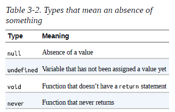

# Programming TypeScript by Boris Cherny

## 1. Introduction
## 2. TypeScript: A 10_000 Foot View
## 3. All About Types
## 4. Functions
## 5. Classes and Interfaces
## 6. Advanced Types
## 7. Handling Errors
## 8. Asynchronous Programming, Concurrency, and Parallelism
## 9. Frontend and Backend Frameworks
## 10. Namespaces.Modules
## 11. Interoperating with JavaScript
## 12. Building and Running TypeScript
## 13. Conclusion

---
---

# 1. Introduction

\-

# 2. TypeScript: A 10_000 Foot View

## The Compiler

Depending on what programming languages you worked with in the past (that is, before you decided to buy this book and commit to a life of type safety), you’ll have a different understanding of how programs work. The way TypeScript works is unusual compared to other mainstream languages like JavaScript or Java, so it’s important that we’re on the same page before we go any further.

Let’s start broad: programs are files that contain a bunch of text written by you, the programmer. That text is parsed by a special program called a compiler, which transforms it into an abstract syntax tree (AST), a data structure that ignores things like whitespace, comments, and where you stand on the tabs versus spaces debate. The compiler then converts that AST to a lower-level representation called bytecode. You can feed that bytecode into another program called a runtime to evaluate it and get a result. So when you run a program, what you’re really doing is telling the runtime to evaluate the bytecode generated by the compiler from the AST parsed from your source code. The details vary, but for most languages this is an accurate high-level view.

Once again, the steps are:

1. Program is parsed into an AST.
2. AST is compiled to bytecode.
3. Bytecode is evaluated by the runtime.

Where TypeScript is special is that instead of compiling straight to bytecode, TypeScript compiles to… JavaScript code! You then run that JavaScript code like you normally would—in your browser, or with NodeJS, or by hand with a paper and pen (for anyone reading this after the machine uprising has begun).

At this point you may be thinking: “Wait! In the last chapter you said TypeScript makes my code safer! When does that happen?”

Great question. I actually skipped over a crucial step: after the TypeScript Compiler generates an AST for your program—but before it emits code—it typechecks your code.

> ***TYPECHECKER: A special program that verifies that your code is typesafe.***

This typechecking is the magic behind TypeScript. It’s how TypeScript makes sure that your program works as you expect, that there aren’t obvious mistakes, and that the cute barista across the street really will call you back when they said they would. (Don’t worry, they’re probably just busy.)

So if we include typechecking and JavaScript emission, the process of compiling TypeScript now looks roughly like Figure 2-1:


Steps 1–3 are done by TSC, and steps 4–6 are done by the JavaScript runtime that lives in your browser, NodeJS, or whatever JavaScript engine you’re using.

JavaScript compilers and runtimes tend to be smushed into a single program called an engine; as a programmer, this is what you’ll normally interact with. It’s how V8 (the engine powering NodeJS, Chrome, and Opera), SpiderMonkey (Firefox), JSCore (Safari), and Chakra (Edge) work, and it’s what gives JavaScript the appearance of being an interpreted language.

In this process, steps 1–2 use your program’s types; step 3 does not. That’s worth reiterating: when TSC compiles your code from TypeScript to JavaScript, it won’t look at your types. That means your program’s types will never affect your program’s generated output, and are only used for typechecking. This feature makes it foolproof to play around with, update, and improve your program’s types, without risking breaking your application.

## The Type System

Modern languages have all sorts of different type systems.

> ***TYPE SYSTEM: A set of rules that a typechecker uses to assign types to your program***

There are generally two kinds of type systems: type systems in which you have to tell the compiler what type everything is with explicit syntax, and type systems that infer the types of things for you automatically. Both approaches have trade-offs.

TypeScript is inspired by both kinds of type systems: you can explicitly annotate your types, or you can let TypeScript infer most of them for you.

To explicitly signal to TypeScript what your types are, use annotations. Annotations take the form value: type and tell the typechecker, “Hey! You see this value here? Its type is type.” Let’s look at a few examples (the comments following each line are the actual types inferred by TypeScript):

```TypeScript
let a: number = 1 // a is a number
let b: string = 'hello' // b is a string
let c: boolean[] = [true, false] // c is an array of booleans
```

And if you want TypeScript to infer your types for you, just leave them off and let TypeScript get to work:

```TypeScript
let a = 1 // a is a number
let b = 'hello' // b is a string
let c = [true, false] // c is an array of booleans
```

Right away, you’ll notice how good TypeScript is at inferring types for you. If you leave off the annotations, the types are the same! Throughout this book, we will use annotations only when necessary, and let TypeScript work its inference magic for us whenever possible.

In general, it is good style to let TypeScript infer as many types as it can for you, keeping explicitly typed code to a minimum.

## TypeScript versus JavaScript

Let’s take a deeper look at TypeScript’s type system, and how it compares to JavaScript’s type system. Table 2-1 presents an overview. A good understanding of the differences is key to building a mental model of how TypeScript works.


### How are types bound ?

Dynamic type binding means that JavaScript needs to actually run your program to know the types of things in it. JavaScript doesn’t know your types before running your program.

TypeScript is a gradually typed language. That means that TypeScript works best when it knows the types of everything in your program at compile time, but it doesn’t have to know every type in order to compile your program. Even in an untyped program TypeScript can infer some types for you and catch some mistakes, but without knowing the types for everything, it will let a lot of mistakes slip through to your users.

This gradual typing is really useful for migrating legacy codebases from untyped JavaScript to typed TypeScript (more on that in “Gradually Migrating from JavaScript to TypeScript”), but unless you’re in the middle of migrating your codebase, you should aim for 100% type coverage. That is the approach this book takes, except where explicitly noted.

### Are types automatically converted ?

JavaScript is weakly typed, meaning if you do something invalid like add a number and an array (like we did in Chapter 1), it will apply a bunch of rules to figure out what you really meant so it can do the best it can with what you gave it. Let’s walk through the specific example of how JavaScript evaluates ```3 + [1]```:

1. JavaScript notices that 3 is a number and [1] is an array.
2. Because we’re using +, it assumes we want to concatenate the two.
3. It implicitly converts 3 to a string, yielding "3".
4. It implicitly converts [1] to a string, yielding "1".
5. It concatenates the results, yielding "31".

We could do this more explicitly too (so JavaScript avoids doing steps 1, 3, and 4):

```JavaScript
3 + [1]; // evaluates to "31"
(3).toString() + [1].toString() // evaluates to "31"
```

While JavaScript tries to be helpful by doing clever type conversions for you, TypeScript complains as soon as you do something invalid. When you run that same JavaScript code through TSC, you’ll get an error:

```JavaScript
3 + [1]; // Error TS2365: Operator '+' cannot be applied to types '3' and 'number[]'.
(3).toString() + [1].toString() // evaluates to "31"
```

If you do something that doesn’t seem right, TypeScript complains, and if you’re explicit about your intentions, TypeScript gets out of your way. This behavior makes sense: who in their right mind would try to add a number and an array, expecting the result to be a string (of course, besides Bavmorda the JavaScript witch who spends her time coding by candlelight in your startup’s basement)?

The kind of implicit conversion that JavaScript does can be a really hard-totrack- down source of errors, and is the bane of many JavaScript programmers. It makes it hard for individual engineers to get their jobs done, and it makes it even harder to scale code across a large team, since every engineer needs to understand the implicit assumptions your code makes.

In short, if you must convert types, do it explicitly.

### When are types checked ?

In most places JavaScript doesn’t care what types you give it, and it instead tries to do its best to convert what you gave it to what it expects.

TypeScript, on the other hand, typechecks your code at compile time (remember step 2 in the list at the beginning of this chapter?), so you don’t need to actually run your code to see the Error from the previous example. TypeScript statically analyzes your code for errors like these, and shows them to you before you run it. If your code doesn’t compile, that’s a really good sign that you made a mistake and you should fix it before you try to run the code.

Figure 2-2 shows what happens when I type the last code example into VSCode (my code editor of choice).


With a good TypeScript extension for your preferred code editor, the error will show up as a red squiggly line under your code as you type it. This dramatically speeds up the feedback loop between writing code, realizing that you made a mistake, and updating the code to fix that mistake.

### When are errors surfaced ?

When JavaScript throws exceptions or performs implicit type conversions, it does so at runtime. This means you have to actually run your program to get a useful signal back that you did something invalid. In the best case, that means as part of a unit test; in the worst case, it means an angry email from a user.

TypeScript throws both syntax-related errors and type-related errors at compile time. In practice, that means those kinds of errors will show up in your code editor, right as you type—it’s an amazing experience if you’ve never worked with an incrementally compiled statically typed language before.

That said, there are lots of errors that TypeScript can’t catch for you at compile time—things like stack overflows, broken network connections, and malformed user inputs—that will still result in runtime exceptions. What TypeScript does is make compile-time errors out of most errors that would have otherwise been runtime errors in a pure JavaScript world.

## Code Editor Setup

You must first install typescript and its linter:

```bash
# Install TSC, TSLint, and type declarations for NodeJS
$ npm install --save-dev typescript tslint @types/node
```

### tsconfig.json

Every TypeScript project should include a file called tsconfig.json in its root directory. This tsconfig.json is where TypeScript projects define things like which files should be compiled, which directory to compile them to, and which version of JavaScript to emit.

Create a new file called tsconfig.json in your root folder (touch tsconfig.json), then pop it open in your code editor and give it the following contents:

```json
{
    "compilerOptions": {
        "lib": ["es2015"],
        "module": "commonjs",
        "outDir": "dist",
        "sourceMap": true,
        "strict": true,
        "target": "es2015"
    },
    "include": [
        "src"
    ]
}
```

Let’s briefly go over some of those options and what they mean (Table 2-2):


Note that while using a tsconfig.json file to configure TSC is handy because it lets us check that configuration into source control, you can set most of TSC’s options from the command line too. Run ./node_modules/.bin/tsc --help for a list of available command-line options.

### tslint.json

Your project should also have a tslint.json file containing your TSLint configuration, codifying whatever stylistic conventions you want for your code (tabs versus spaces, etc.).

Using TSLint is optional, but it’s strongly recommend for all TypeScript projects to enforce a consistent coding style. Most importantly, it will save you from arguing over code style with coworkers during code reviews.

The following command will generate a tslint.json file with a default TSLint configuration: ```./node_modules/.bin/tslint --init```

You can then add overrides to this to conform with your own coding style. For example, my tslint.json looks like this:

```json
{
    "defaultSeverity": "error",
    "extends": [
        "tslint:recommended"
    ],
    "rules": {
        "semicolon": false,
        "trailing-comma": false
    }
}
```

For the full list of available rules, head over to the TSLint documentation. You can also add custom rules, or install extra presets (like for ReactJS).

### Compile and run

You can compile and run your code using:

```bash
# Compile your TypeScript with TSC
$ ./node_modules/.bin/tsc
# Run your code with NodeJS
$ node ./dist/index.js
```

You can also look into ```ts-node``` to run your code in a singe command and use a scaffolindg tool like ```typescript-node-starter```.

# 3. All About Types

## Introduction

> ***TYPE: A set of values and the things you can do with them.***

If that sounds confusing, let me give a few familiar examples:

* The boolean type is the set of all booleans (there are just two: true and false) and the operations you can perform on them (like ||, &&, and !).
* The number type is the set of all numbers and the operations you can perform on them (like +, -, *, /, %, ||, &&, and ?), including the methods you can call on them like .toFixed, .toPrecision, .toString, and so on.
* The string type is the set of all strings and the operations you can perform on them (like +, ||, and &&), including the methods you can call on them like .concat and .toUpperCase.

When you see that something is of type T, not only do you know that it’s a T, but you also know exactly what you can do with that T (and what you can’t). Remember, the whole point is to use the typechecker to stop you from doing invalid things. And the way the typechecker knows what’s valid and what’s not is by looking at the types you’re using and how you’re using them.


## ```any```

any is the Godfather of types. It does anything for a price, but you don’t want to ask any for a favor unless you’re completely out of options. In TypeScript everything needs to have a type at compile time, and any is the default type when you (the programmer) and TypeScript (the typechecker) can’t figure out what type something is. It’s a last resort type, and you should avoid it when possible.

Why should you avoid it? Remember what a type is? (It’s a set of values and the things you can do with them.) any is the set of all values, and you can do anything with any. That means that if you have a value of type any you can add to it, multiply by it, call .pizza() on it—anything.

any makes your value behave like it would in regular JavaScript, and totally prevents the typechecker from working its magic. When you allow any into your code you’re flying blind. Avoid any like fire, and use it only as a very, very last resort.

On the rare occasion that you do need to use it, you do it like this:\

```TypeScript
let a: any = 666 // any
let b: any = ['danger'] // any
let c = a + b // any
```

Notice how the third type should report an error (why are you trying to add a number and an array?), but doesn’t because you told TypeScript that you’re adding two anys. If you want to use any, you have to be explicit about it. When TypeScript infers that some value is of type any (for example, if you forgot to annotate a function’s parameter, or if you imported an untyped JavaScript module), it will throw a compile-time exception and toss a red squiggly at you in your editor. By explicitly annotating a and b with the any type (: any), you avoid the exception—it’s your way of telling TypeScript that you know what you’re doing.

### TSC FLAG: NOIMPLICITANY

By default, TypeScript is permissive, and won’t complain about values that it infers as any. To get TypeScript to complain about implicit anys, be sure to enable the noImplicitAny flag in your tsconfig.json. noImplicitAny is part of the strict family of TSC flags, so if you already enabled strict in your tsconfig.json (as we did in “tsconfig.json”), you’re good to go.

## ```unknown```

For the few cases where you have a value whose type you really don’t know ahead of time, don’t use any, and instead reach for unknown. Like any, it represents any value, but TypeScript won’t let you use an unknown type until you refine it by checking what it is (see “Refinement”).

What operations does unknown support? You can compare unknown values (with ==, ===, ||, &&, and ?), negate them (with !), and refine them (like you can any other type) with JavaScript’s typeof and instanceof operators. Use unknown like this:

```TypeScript
let a: unknown = 30 // unknown
let b = a === 123 // boolean
let c = a + 10 // Error TS2571: Object is of type 'unknown'.
if (typeof a === 'number') {
let d = a + 10 // number
}
```

This example should give you a rough idea of how to use unknown:

1. TypeScript will never infer something as unknown—you have to explicitly annotate it (a).
2. You can compare values to values that are of type unknown (b).
3. But, you can’t do things that assume an unknown value is of a specific type (c); you have to prove to TypeScript that the value really is of that type first (d).

## ```boolean```

The boolean type has two values: true and false. You can compare them (with ==, ===, ||, &&, and ?), negate them (with !), and not much else. Use boolean like this:

```TypeScript
let a = true // boolean
var b = false // boolean
const c = true // true
let d: boolean = true // boolean
let e: true = true // true
let f: true = false // Error TS2322: Type 'false' is not assignable
// to type 'true'.
```

This example shows a few ways to tell TypeScript that something is a boolean:

1. You can let TypeScript infer that your value is a boolean (a and b).
2. You can let TypeScript infer that your value is a specific boolean (c).
3. You can tell TypeScript explicitly that your value is a boolean (d).
4. You can tell TypeScript explicitly that your value is a specific boolean (e and f).

In general, you will use the first or second way in your programs. Very rarely, you’ll use the fourth way—only when it buys you extra type safety (I’ll show you examples of that throughout this book). You will almost never use the third way.

The second and fourth cases are particularly interesting because while they do something intuitive, they’re supported by surprisingly few programming languages and so might be new to you. What I did in that example was say, “Hey TypeScript! See this variable e here? e isn’t just any old boolean— it’s the specific boolean true.” By using a value as a type, I essentially limited the possible values for e and f from all booleans to one specific boolean each. **This feature is called type literals.**

> ***TYPE LITERAL: A type that represents a single value and nothing else.***

In the fourth case I explicitly annotated my variables with type literals, and in the second case TypeScript inferred a literal type for me because I used const instead of let or var. Because TypeScript knows that once a primitive is assigned with const its value will never change, it infers the most narrow type it can for that variable. That’s why in the second case TypeScript inferred c’s type as true instead of as boolean. To learn more about why TypeScript infers different types for let and const, jump ahead to “Type Widening”.

## ```number```

number is the set of all numbers: integers, floats, positives, negatives, Infinity, NaN, and so on. Numbers can do, well, numbery things, like addition (+), subtraction (-), modulo (%), and comparison (<). Let’s look at a few examples:

```TypeScript
let a = 1234 // number
var b = Infinity * 0.10 // number
const c = 5678 // 5678
let d = a < b // boolean
let e: number = 100 // number
let f: 26.218 = 26.218 // 26.218
let g: 26.218 = 10 // Error TS2322: Type '10' is not assignable
// to type '26.218'.
```

Like in the boolean example, there are four ways to type something as a number:

1. You can let TypeScript infer that your value is a number (a and b).
2. You can use const so TypeScript infers that your value is a specific number (c).
3. You can tell TypeScript explicitly that your value is a number (e).
4. You can tell TypeScript explicitly that your value is a specific number (f and g).

And just like with booleans, you’re usually going to let TypeScript infer the type for you (the first way). Once in a while you’ll do some clever programming that requires your number’s type to be restricted to a specific value (the second or fourth way). There is no good reason to explicitly type something as a number (the third way).

When working with long numbers, use numeric separators to make those numbers easier to read. You can use numeric separators in both type and value positions:

```TypeScript
let oneMillion = 1_000_000 // Equivalent to 1000000
let twoMillion: 2_000_000 = 2_000_000
```

## ```bigint```

bigint is a newcomer to JavaScript and TypeScript: it lets you work with large integers without running into rounding errors. While the number type can only represent whole numbers up to 2 , bigint can represent integers bigger than that too. The bigint type is the set of all BigInts, and supports things like addition (+), subtraction (-), multiplication (*), division (/), and comparison (<). Use it like this:

```TypeScript
let a = 1234n // bigint
const b = 5678n // 5678n
var c = a + b // bigint
let d = a < 1235 // boolean
let e = 88.5n // Error TS1353: A bigint literal must be an
integer.
let f: bigint = 100n // bigint
let g: 100n = 100n // 100n
let h: bigint = 100 // Error TS2322: Type '100' is not assignable
// to type 'bigint'.
```

Like with boolean and number, there are four ways to declare bigints. Try to let TypeScript infer your bigint’s type when you can.

## ```string```

string is the set of all strings and the things you can do with them like concatenate (+), slice (.slice), and so on. Let’s see some examples:

```TypeScript
let a = 'hello' // string
var b = 'billy' // string
const c = '!' // '!'
let d = a + ' ' + b + c // string
let e: string = 'zoom' // string
let f: 'john' = 'john' // 'john'
let g: 'john' = 'zoe' // Error TS2322: Type "zoe" is not assignable
// to type "john".
```

Like boolean and number, there are four ways to declare string types, and you should let TypeScript infer the type for you whenever you can.

## ```symbol```

symbol is a relatively new language feature that arrived with one of the latest major JavaScript revisions (ES2015). Symbols don’t come up often in practice; they are used as an alternative to string keys in objects and maps, in places where you want to be extra sure that people are using the right well-known key and didn’t accidentally set the key—think setting a default iterator for your object (Symbol.iterator), or overriding at runtime whether or not your object is an instance of something (Symbol.hasInstance). Symbols have the type symbol, and there isn’t all that much you can do with them:

```TypeScript
let a = Symbol('a') // symbol
let b: symbol = Symbol('b') // symbol
var c = a === b // boolean
let d = a + 'x' // Error TS2469: The '+' operator cannot be applied // to type 'symbol'.
```

The way Symbol('a') works in JavaScript is by creating a new symbol with the given name; that symbol is unique, and will not be equal (when compared with == or ===) to any other symbol (even if you create a second symbol with the same exact name!). Similarly to how the value 27 is inferred to be a number when declared with let but the specific number 27 when you declare it with const, symbols are inferred to be of type symbol but can be explicitly typed as unique symbol:

```TypeScript
const e = Symbol('e') // typeof e
const f: unique symbol = Symbol('f') // typeof f
let g: unique symbol = Symbol('f') // Error TS1332: A variable whose type is a
                                   // 'unique symbol' type must be 'const'.
let h = e === e // boolean
let i = e === f // Error TS2367: This condition will always return
                // 'false' since the types 'unique symbol' and
                // 'unique symbol' have no overlap.
```

This example shows off a few ways to create unique symbols:

1. When you declare a new symbol and assign it to a const variable (not a let or var variable), TypeScript will infer its type as unique symbol. It will show up as typeof yourVariableName, not unique symbol, in your code editor.
2. You can explicitly annotate a const variable’s type as unique symbol.
3. A unique symbol is always equal to itself.
4. TypeScript knows at compile time that a unique symbol will never be equal to any other unique symbol.

Think of unique symbols like other literal types, like 1, true, or "literal". They’re a way to create a type that represents a particular inhabitant of symbol.

## Objects

TypeScript’s object types specify the shapes of objects. Notably, they can’t tell the difference between simple objects (like the kind you make with {}) and more complicated ones (the kind you create with new Blah). This is by design: JavaScript is generally structurally typed, so TypeScript favors that style of programming over a nominally typed style.

> ***STRUCTURAL TYPING***: A style of programming where you just care that an object has certain properties, and not what its name is (nominal typing). **Also called duck typing** in some languages (or, not judging a book by its cover).

There are a few ways to use types to describe objects in TypeScript. The first is to declare a value as an object:

```TypeScript
let a: object = {
    b: 'x'
}
```

What happens when you access b?

```TypeScript
a.b // Error TS2339: Property 'b' does not exist on type 'object'.
```

Wait, that’s not very useful! What’s the point of typing something as an object if you can’t do anything with it?

Why, that’s a great point, aspiring TypeScripter! In fact, object is a little narrower than any, but not by much. object doesn’t tell you a lot about the value it describes, just that the value is a JavaScript object (and that it’s not null).

What if we leave off the explicit annotation, and let TypeScript do its thing?

```TypeScript
let a = {
    b: 'x'
} // {b: string}

a.b // string

let b = {
    c: {
        d: 'f'
    }
} // {c: {d: string}}
```

Voilà! You’ve just discovered the second way to type an object: object literal syntax (not to be confused with type literals). You can either let TypeScript infer your object’s shape for you, or explicitly describe it inside curly braces({}):

```TypeScript
let a: {b: number} = {
    b: 12
} // {b: number}
```

> ***TYPE INFERENCE WHEN DECLARING OBJECTS WITH CONST***
> What would have happened if we’d used const to declare the object instead?

```TypeScript
const a: {b: number} = {
    b: 12
} // Still {b: number}
```

> You might be surprised that TypeScript inferred b as a number, and not as the literal 12. After all, we learned that when declaring numbers or strings, our choice of const or let affects how TypeScript infers our types.
> Unlike the primitive types we’ve looked at so far—boolean, number, bigint, string, and symbol—declaring an object with const won’t hint to TypeScript to infer its type more narrowly. That’s because JavaScript objects are mutable, and for all TypeScript knows you might update their fields after you create them.

Object literal syntax says, “Here is a thing that has this shape.” The thing might be an object literal, or it might be a class:

```TypeScript
let c: {
    firstName: string
    lastName: string
} = {
    firstName: 'john',
    lastName: 'barrowman'
}

class Person {
    constructor(
        public firstName: string, // public is shorthand for
        // this.firstName = firstName
        public lastName: string
    ) {}
}

c = new Person('matt', 'smith') // OK
```

```{firstName: string, lastName: string}``` describes the shape of an object, and both the object literal and the class instance from the last example satisfy that shape, so TypeScript lets us assign a Person to c.

Let’s explore what happens when we add extra properties, or leave out required ones:

```TypeScript
let a: {b: number}

a = {} // Error TS2741: Property 'b' is missing in type '{}'
// but required in type '{b: number}'.

a = {
    b: 1,
    c: 2 // Error TS2322: Type '{b: number; c: number}' is not assignable
} // to type '{b: number}'. Object literal may only specify known
// properties, and 'c' does not exist in type '{b: number}'.
```

> ***DEFINITE ASSIGNMENT***
> This is the first example we’ve looked at where we first declare a variable (a), then initialize it with values ({} and {b: 1, c: 2}). This is a common JavaScript pattern, and it’s supported by TypeScript too.
> When you declare a variable in one place and initialize it later, TypeScript will make sure that your variable is definitely assigned a value by the time you use it:
```TypeScript
let i: number
let j = i * 3 // Error TS2454: Variable 'i' is used
// before being assigned.
```
> And don’t worry, TypeScript enforces this for you even if you leave off the explicit type annotation:
```TypeScript
let i
let j = i * 3 // Error TS2532: Object is possibly
// 'undefined'.
```

By default, TypeScript is pretty strict about object properties—if you say the object should have a property called b that’s a number, TypeScript expects b and only b. If b is missing, or if there are extra properties, TypeScript will complain.

Can you tell TypeScript that something is optional, or that there might be more properties than you planned for? You bet:

```TypeScript
let a: {
    b: number // 1
    c?: string // 2
    [key: number]: boolean // 3
}
```

1. a has a property b that’s a number.

2. a might have a property c that’s a string. And if c is set, it might be undefined.

3. a might have any number of numeric properties that are booleans.

Let’s see what types of objects we can assign to a:

```TypeScript
a = {b: 1}
a = {b: 1, c: undefined}
a = {b: 1, c: 'd'}
a = {b: 1, 10: true}
a = {b: 1, 10: true, 20: false}
a = {10: true} // Error TS2741: Property 'b' is missing in type
// '{10: true}'.
a = {b: 1, 33: 'red'} // Error TS2741: Type 'string' is not assignable
// to type 'boolean'.
```

> ***Index Signatures***
> The [key: T]: U syntax is called an index signature, and this is the way you tell TypeScript that the given object might contain more keys.
> The way to read it is, “For this object, all keys of type T must have values of type U.” Index signatures let you safely add more keys to an object, in addition to any keys that you explicitly declared. There is one rule to keep in mind for index signatures: the index signature key’s type (T) must be assignable to either number or string.
> Also note that you can use any word for the index signature key’s name —it doesn’t have to be key:

```TypeScript
let airplaneSeatingAssignments: {
    [seatNumber: string]: string
} = {
    '34D': 'Boris Cherny',
    '34E': 'Bill Gates'
}
```

Optional (?) isn’t the only modifier you can use when declaring object types. You can also mark fields as read-only (that is, you can declare that a field can’t be modified after it’s assigned an initial value—kind of like const for object properties) with the readonly modifier:

```TypeScript
let user: {
readonly firstName: string
} = {
    firstName: 'abby'
}

user.firstName // string
user.firstName = 'abbey with an e' // Error TS2540: Cannot assign to 'firstName' because it
// is a read-only property.
```

Object literal notation has one special case: empty object types ({}). Every type—except null and undefined—is assignable to an empty object type, which can make it tricky to use. Try to avoid empty object types when possible:

```TypeScript
let danger: {}
danger = {}
danger = {x: 1}
danger = []
danger = 2
```

As a final note on objects, it’s worth mentioning one last way of typing something as an object: Object. This is pretty much the same as using {}, and is best avoided.

To summarize, there are four ways to declare objects in TypeScript:

1. Object literal notation (like {a: string}), also called a shape. Use this when you know which fields your object could have, or when all of your object’s values will have the same type.
2. Empty object literal notation ({}). Try to avoid this.
3. The object type. Use this when you just want an object, and don’t care about which fields it has.
4. The Object type. Try to avoid this.

In your TypeScript programs, you should almost always stick to the first way and the third way. Be careful to avoid the second and fourth ways—use a linter to warn about them, complain about them in code reviews, print posters—use your team’s preferred tool to keep them far away from your codebase.


## Type Aliases

Just like you can use variable declarations (let, const, and var) to declare a variable that aliases a value, you can declare a type alias that points to a type. It looks like this:

```TypeScript
type Age = number

type Person = {
    name: string
    age: Age
}
```

Age is but a number. It can also help make the definition of the Person shape easier to understand. Aliases are never inferred by TypeScript, so you have to type them explicitly:

```TypeScript
let age: Age = 55

let driver: Person = {
    name: 'James May',
    age: age
}
```

Because Age is just an alias for number, that means it’s also assignable to number, so we can rewrite this as:

```TypeScript
let age = 55

let driver: Person = {
    name: 'James May',
    age: age
}
```

Wherever you see a type alias used, you can substitute in the type it aliases without changing the meaning of your program.

Like JavaScript variable declarations (let, const, and var), you can’t declare a type twice:

```TypeScript
type Color = 'red'
type Color = 'blue' // Error TS2300: Duplicate identifier 'Color'.
```

And like let and const, type aliases are block-scoped. Every block and every function has its own scope, and inner type alias declarations shadow outer ones:

```TypeScript
type Color = 'red'

let x = Math.random() < .5

if (x) {
    type Color = 'blue' // This shadows the Color declared above.
    let b: Color = 'blue'
} else {
    let c: Color = 'red'
}
```

Type aliases are useful for DRYing up repeated complex types, and for making it clear what a variable is used for (some people prefer descriptive type names to descriptive variable names!). When deciding whether or not to alias a type, use the same judgment as when deciding whether or not to pull a value out into its own variable.

## Union and intersection types

If you have two things A and B, the union of those things is their sum (everything in A or B or both), and the intersection is what they have in common (everything in both A and B). The easiest way to think about this is 4 with sets. In Figure 3-2 I represent sets as circles. On the left is the union, or sum, of the two sets; on the right is their intersection, or product.


TypeScript gives us special type operators to describe unions and intersections of types: | for union and & for intersection. Since types are a lot like sets, we can think of them in the same way:

```TypeScript
type Cat = {name: string, purrs: boolean}
type Dog = {name: string, barks: boolean, wags: boolean}
type CatOrDogOrBoth = Cat | Dog
type CatAndDog = Cat & Dog
```

If something is a CatOrDogOrBoth, what do you know about it? You know that it has a name property that’s a string, and not much else. On the flip side, what can you assign to a CatOrDogOrBoth? Well, a Cat, a Dog, or both:

```TypeScript
// Cat
let a: CatOrDogOrBoth = {
    name: 'Bonkers',
    purrs: true
}

// Dog
a = {
    name: 'Domino',
    barks: true,
    wags: true
}

// Both
a = {
    name: 'Donkers',
    barks: true,
    purrs: true,
    wags: true
}
```

This is worth reiterating: a value with a union type (|) isn’t necessarily one specific member of your union; in fact, it can be both members at once!

On the other hand, what do you know about CatAndDog? Not only does your canine-feline hybrid super-pet have a name, but it can purr, bark, and wag:

```TypeScript
let b: CatAndDog = {
    name: 'Domino',
    barks: true,
    purrs: true,
    wags: true
}
```

Unions come up naturally a lot more often than intersections do. Take this function, for example:

```TypeScript
function trueOrNull(isTrue: boolean) {
    if (isTrue) {
        return 'true'
    }
    return null
}
```

What is the type of the value this function returns? Well, it might be a string, or it might be null. We can express its return type as:

```TypeScript
type Returns = string | null
```

How about this one?

```TypeScript
function(a: string, b: number) {
    return a || b
}
```

If a is truthy then the return type is string, and otherwise it’s number: in other words, string | number.

The last place where unions come up naturally is in arrays (specifically the heterogeneous kind), which we’ll talk about next.

## Arrays

Like in JavaScript, TypeScript arrays are special kinds of objects that support things like concatenation, pushing, searching, and slicing. It’s example time:

```TypeScript
let a = [1, 2, 3] // number[]
var b = ['a', 'b'] // string[]
let c: string[] = ['a'] // string[]
let d = [1, 'a'] // (string | number)[]
const e = [2, 'b'] // (string | number)[]

let f = ['red']
f.push('blue')
f.push(true) // Error TS2345: Argument of type 'true' is not
// assignable to parameter of type 'string'.

let g = [] // any[]
g.push(1) // number[]
g.push('red') // (string | number)[]

let h: number[] = [] // number[]
h.push(1) // number[]
h.push('red') // Error TS2345: Argument of type '"red"' is not
// assignable to parameter of type 'number'.
```

TypeScript supports two syntaxes for arrays: T[] and Array<T>. They are identical both in meaning and in performance. This book uses T[] syntax for its terseness, but you should pick whichever style you like for your own code.

As you read through these examples, notice that everything but c and h is implicitly typed. You’ll also notice that TypeScript has rules about what you can and can’t put in an array.

The general rule of thumb is to keep arrays homogeneous. That is, don’t mix apples and oranges and numbers in a single array—try to design your programs so that every element of your array has the same type. The reason is that otherwise, you’re going to have to do more work to prove to TypeScript that what you’re doing is safe.

To see why things are easier when your arrays are homogeneous, take a look at example f. I initialized an array with the string 'red' (at the point when I declared the array it contained just strings, so TypeScript inferred that it must be an array of strings). I then pushed 'blue' onto it; 'blue' is a string, so TypeScript let it pass. Then I tried to push true onto the array, but that failed! Why? Because f is an array of strings, and true is not a string.

On the other hand, when I initialized d I gave it a number and a string, so TypeScript inferred that it must be an array of type number | string. Because each element might be either a number or a string, you have to check which it is before using it. For example, say you want to map over that array, converting every letter to uppercase and tripling every number:

```TypeScript
let d = [1, 'a']

d.map(_ => {
    if (typeof _ === 'number') {
        return _ * 3
    }
    return _.toUpperCase()
})
```

You have to query the type of each item with typeof, checking if it’s a number or a string before you can do anything with it.

Like with objects, creating arrays with const won’t hint to TypeScript to infer their types more narrowly. That’s why TypeScript inferred both d and e to be arrays of number | string.

g is the special case: when you initialize an empty array, TypeScript doesn’t know what type the array’s elements should be, so it gives you the benefit of the doubt and makes them any. As you manipulate the array and add elements to it, TypeScript starts to piece together your array’s type. Once your array leaves the scope it was defined in (for example, if you declared it in a function, then returned it), TypeScript will assign it a final type that can’t be expanded anymore:

```TypeScript
function buildArray() {
    let a = [] // any[]

    a.push(1) // number[]
    a.push('x') // (string | number)[]

    return a
}

let myArray = buildArray() // (string | number)[]
myArray.push(true) // Error 2345: Argument of type 'true' is not 
                   // assignable to parameter of type 'string | number'.
```

So as far as uses of any go, this one shouldn’t make you sweat too much.

## Tuples

Tuples are subtypes of array. They’re a special way to type arrays that have fixed lengths, where the values at each index have specific, known types. Unlike most other types, tuples have to be explicitly typed when you declare them. That’s because the JavaScript syntax is the same for tuples and arrays (both use square brackets), and TypeScript already has rules for inferring array types from square brackets:

```TypeScript
let a: [number] = [1]
// A tuple of [first name, last name, birth year]

let b: [string, string, number] = ['malcolm', 'gladwell', 1963]
b = ['queen', 'elizabeth', 'ii', 1926] // Error TS2322: Type 'string' is not
// assignable to type 'number'.
```

Tuples support optional elements too. Just like in object types, ? means “optional”:

```TypeScript
// An array of train fares, which sometimes vary depending on direction
let trainFares: [number, number?][] = [
    [3.75],
    [8.25, 7.70],
    [10.50]
]

// Equivalently:
let moreTrainFares: ([number] | [number, number])[] = [
// ...
]
```

Tuples also support rest elements, which you can use to type tuples with minimum lengths:

```TypeScript
// A list of strings with at least 1 element
let friends: [string, ...string[]] = ['Sara', 'Tali', 'Chloe', 'Claire']

// A heterogeneous list
let list: [number, boolean, ...string[]] = [1, false, 'a', 'b', 'c']
```

Not only do tuple types safely encode heterogeneous lists, but they also capture the length of the list they type. These features buy you significantly more safety than plain old arrays—use them often.

### Read-only arrays and tuples

While regular arrays are mutable (meaning you can .push onto them, .splice them, and update them in place), which is probably what you want most of the time, sometimes you want an immutable array—one that you can update to produce a new array, leaving the original unchanged.

TypeScript comes with a readonly array type out of the box, which you can use to create immutable arrays. Read-only arrays are just like regular arrays, but you can’t update them in place. To create a read-only array, use an explicit type annotation; to update a read-only array, use nonmutating methods like .concat and .slice instead of mutating ones like .push and .splice:

```TypeScript
let as: readonly number[] = [1, 2, 3] // readonly number[]
let bs: readonly number[] = as.concat(4) // readonly number[]
let three = bs[2] // number

as[4] = 5 // Error TS2542: Index signature in type
// 'readonly number[]' only permits reading.

as.push(6) // Error TS2339: Property 'push' does not
// exist on type 'readonly number[]'.
```

Like Array, TypeScript comes with a couple of longer-form ways to declare read-only arrays and tuples:

```TypeScript
type A = readonly string[] // readonly string[]
type B = ReadonlyArray<string> // readonly string[]
type C = Readonly<string[]> // readonly string[]
type D = readonly [number, string] // readonly [number, string]
type E = Readonly<[number, string]> // readonly [number, string]
```

Which syntax you use—the terser readonly modifier, or the longer-form Readonly or ReadonlyArray utilities—is a matter of taste.

Note that while read-only arrays can make your code easier to reason about in some cases by avoiding mutability, they are backed by regular JavaScript arrays. That means even small updates to an array result in having to copy the original array first, which can hurt your application’s runtime performance if you’re not careful. For small arrays this overhead is rarely noticeable, but for bigger arrays, the overhead can become significant.

## null, undefined, void, and never

JavaScript has two values to represent an absence of something: null and undefined. TypeScript supports both of these as values, and it also has types for them—any guess what they’re called? You got it, the types are called null and undefined too.

They’re both special types, because in TypeScript the only thing of type undefined is the value undefined, and the only thing of type null is the value null.

JavaScript programmers usually use the two interchangeably, though there is a subtle semantic difference worth mentioning: undefined means that something hasn’t been defined yet, and null means an absence of a value (like if you tried to compute a value, but ran into an error along the way). These are just conventions and TypeScript doesn’t hold you to them, but it can be a useful distinction to make.

In addition to null and undefined, TypeScript also has void and never. These are really specific, special-purpose types that draw even finer lines between the different kinds of things that don’t exist: void is the return type of a function that doesn’t explicitly return anything (for example, console.log), and never is the type of a function that never returns at all (like a function that throws an exception, or one that runs forever):

```TypeScript
// (a) A function that returns a number or null
function a(x: number) {
    if (x < 10) {
        return x;
    }
    return null;
}

// (b) A function that returns undefined
function b() {
    return undefined;
}

// (c) A function that returns void
function c() {
    let a = 2 + 2;
    let b = a * a;
}

// (d) A function that returns never
function d() {
    throw TypeError('I always error');
}

// (e) Another function that returns never
function e() {
    while (true) {
        doSomething();
    }
}
```

(a) and (b) explicitly return null and undefined, respectively. (c) returns undefined, but it doesn’t do so with an explicit return statement, so we say it returns void. (d) throws an exception, and (e) runs forever—neither will ever return, so we say their return type is never.

If unknown is the supertype of every other type, then never is the subtype of every other type. We call it a bottom type. That means it’s assignable to every other type, and a value of type never can be used anywhere safely. This has mostly theoretical significance, but is something that will come up when you talk about TypeScript with other language nerds.

Table 3-2 summarizes how the four absence types are used.



### Strict ```null``` checking

In older versions of TypeScript (or with TSC’s strictNullChecks option set to false), null behaves a little differently: it is a subtype of all types, except never. That means every type is nullable, and you can never really trust the type of anything without first checking if it’s null or not. For example, if someone passes the variable pizza to your function and you want to call the method .addAnchovies on it, you first have to check if your pizza is null before you can add delicious tiny fish to it. In practice this is really tedious to do with every single variable, so people often forget to actually check first. Then, when something really is null, you get a dreaded null pointer exception at runtime:

```TypeScript
function addDeliciousFish(pizza: Pizza) {
    return pizza.addAnchovies() // Uncaught TypeError: Cannot read
} // property 'addAnchovies' of null

// TypeScript lets this fly with strictNullChecks = false
addDeliciousFish(null)
```

null has been called the “billion dollar mistake” by the guy that introduced it in the 1960s. The problem with null is it’s something that most languages’ type systems can’t express and don’t check for; so when a programmer tries to do something with a variable that they thought was defined but it actually turns out to be null at runtime, the code throws a runtime exception!

## Enums

Enums are a way to enumerate the possible values for a type. They are unordered data structures that map keys to values. Think of them like objects where the keys are fixed at compile time, so TypeScript can check that the given key actually exists when you access it.

There are two kinds of enums: enums that map from strings to strings, and enums that map from strings to numbers. They look like this:

```TypeScript
enum Language {
    English,
    Spanish,
    Russian
}
```

By convention, enum names are uppercase and singular. Their keys are also uppercase.

TypeScript will automatically infer a number as the value for each member of your enum, but you can also set values explicitly. Let’s make explicit what TypeScript inferred in the previous example:

```TypeScript
enum Language {
    English = 0,
    Spanish = 1,
    Russian = 2
}
```

To retrieve a value from an enum, you access it with either dot or bracket notation—just like you would to get a value from a regular object:

```TypeScript
let myFirstLanguage = Language.Russian // Language
let mySecondLanguage = Language['English'] // Language
```

You can split your enum across multiple declarations, and TypeScript will automatically merge them for you (to learn more, jump ahead to “Declaration Merging”). Beware that when you do split your enum, TypeScript can only infer values for one of those declarations, so it’s good practice to explicitly assign a value to each enum member:

```TypeScript
enum Language {
    English = 0,
    Spanish = 1
}

enum Language {
    Russian = 2
}
```

You can use computed values, and you don’t have to define all of them (TypeScript will do its best to infer what’s missing):

```TypeScript
enum Language {
    English = 100,
    Spanish = 200 + 300,
    Russian // TypeScript infers 501 (the next number after 500)
}
```

You can also use string values for enums, or even mix string and number values:

```TypeScript
enum Color {
    Red = '#c10000',
    Blue = '#007ac1',
    Pink = 0xc10050, // A hexadecimal literal
    White = 255 // A decimal literal
}

let red = Color.Red // Color
let pink = Color.Pink // Color
```

TypeScript lets you access enums both by value and by key for convenience, but this can get unsafe quickly:

```TypeScript
let a = Color.Red // Color
let b = Color.Green // Error TS2339: Property 'Green' does not exist
                    // on type 'typeof Color'.
let c = Color[0] // string
let d = Color[6] // string (!!!)
```

You shouldn’t be able to get Color[6], but TypeScript doesn’t stop you! We can ask TypeScript to prevent this kind of unsafe access by opting into a safer subset of enum behavior with const enum instead. Let’s rewrite our Language enum from earlier:

```TypeScript
const enum Language {
    English,
    Spanish,
    Russian
}

// Accessing a valid enum key
let a = Language.English // Language
                         // Accessing an invalid enum key
let b = Language.Tagalog // Error TS2339: Property 'Tagalog' does not exist
                         // on type 'typeof Language'.
                         // Accessing a valid enum value
let c = Language[0] // Error TS2476: A const enum member can only be
                    // accessed using a string literal.
                    // Accessing an invalid enum value
let d = Language[6] // Error TS2476: A const enum member can only be
                    // accessed using a string literal.
```

A const enum doesn’t let you do reverse lookups, and so behaves a lot like a regular JavaScript object. It also doesn’t generate any JavaScript code by default, and instead inlines the enum member’s value wherever it’s used (for example, TypeScript will replace every occurrence of Language.Spanish with its value, 1).

> ***TSC FLAG: PRESERVECONSTENUMS***
> const enum inlining can lead to safety issues when you import a const enum from someone else’s TypeScript code: if the enum author updates their const enum after you’ve compiled your TypeScript code, then your version of the enum and their version might point to different values at runtime, and TypeScript will be none the wiser.
> If you use const enums, be careful to avoid inlining them and to only use them in TypeScript programs that you control: avoid using them in programs that you’re planning to publish to NPM, or to make available for others to use as a library.
> To enable runtime code generation for const enums, switch the preserveConstEnums TSC setting to true in your tsconfig.json:

```JSON
{
    "compilerOptions": {
        "preserveConstEnums": true
    }
}
```

Let’s see how we use const enums:

```TypeScript
const enum Flippable {
    Burger,
    Chair,
    Cup,
    Skateboard,
    Table
}

function flip(f: Flippable) {
    return 'flipped it';
}

flip(Flippable.Chair) // 'flipped it'
flip(Flippable.Cup) // 'flipped it'
flip(12) // 'flipped it' (!!!)
```

Everything looks great—Chairs and Cups work exactly as you expect… until you realize that all numbers are also assignable to enums! That behavior is an unfortunate consequence of TypeScript’s assignability rules, and to fix it you have to be extra careful to only use string-valued enums:

```TypeScript
const enum Flippable {
    Burger = 'Burger',
    Chair = 'Chair',
    Cup = 'Cup',
    Skateboard = 'Skateboard',
    Table = 'Table'
}

function flip(f: Flippable) {
    return 'flipped it'
}

flip(Flippable.Chair) // 'flipped it'
flip(Flippable.Cup) // 'flipped it'
flip(12) // Error TS2345: Argument of type '12' is not
         // assignable to parameter of type 'Flippable'.
flip('Hat') // Error TS2345: Argument of type '"Hat"' is not
            // assignable to parameter of type 'Flippable'.
```

All it takes is one pesky numeric value in your enum to make the whole enum unsafe.

Because of all the pitfalls that come with using enums safely, I recommend you stay away from them—there are plenty of better ways to express yourself in TypeScript. And if a coworker insists on using enums and there’s nothing you can do to change their mind, be sure to ninja-merge a few TSLint rules while they’re out to warn about numeric values and nonconst enums

# 4. Functions

## Optional and Default Parameters

Like in object and tuple types, you can use ? to mark parameters as optional. When declaring your function’s parameters, required parameters have to come first, followed by optional parameters:

```TypeScript
function log(message: string, userId?: string) {
    let time = new Date().toLocaleTimeString()
    console.log(time, message, userId || 'Not signed in')
}

log('Page loaded') // Logs "12:38:31 PM Page loaded Not signed in"
log('User signed in', 'da763be') // Logs "12:38:31 PM User signed in da763be"
```

Like in JavaScript, you can provide default values for optional parameters. Semantically it’s similar to making a parameter optional, in that callers no longer have to pass it in (a difference is that default parameters don’t have to be at the end of your list of parameters, while optional parameters do).

For example, we can rewrite log as:

```TypeScript
function log(message: string, userId = 'Not signed in') {
    let time = new Date().toISOString()
    console.log(time, message, userId)
}

log('User clicked on a button', 'da763be')
log('User signed out')
```

Notice how when we give userId a default value, we remove its optional annotation, ?. We also don’t have to type it anymore. TypeScript is smart enough to infer the parameter’s type from its default value, keeping our code terse and easy to read.

Of course, you can also add explicit type annotations to your default parameters, the same way you can for parameters without defaults:

```TypeScript
type Context = {
    appId?: string
    userId?: string
}

function log(message: string, context: Context = {}) {
    let time = new Date().toISOString()
    console.log(time, message, context.userId)
}
```

You’ll find yourself using default parameters over optional parameters often.

## Rest Parameters

If a function takes a list of arguments, you can of course simply pass the list in as an array:

Sometimes, you might opt for a variadic function API—one that takes a variable number of arguments—instead of a fixed-arity API that takes a fixed number of arguments. Traditionally, that required using JavaScript’s magic arguments object.

You can also use ```arguments``` but the problem with ```arguments``` is that it is very unsafe since each item inside ```arguments``` is typed with ```any```. Besides that, ```arguments``` is not even a real array so you always have to transform it into a real array

Rest parameters to the rescue! Instead of resorting to the unsafe arguments magic variable, we can instead use rest parameters to safely make our sum function accept any number of arguments:

```TypeScript
function sum(numbers: number[]): number {
    return numbers.reduce((total, n) => total + n, 0)
}

sum([1, 2, 3]) // evaluates to 6
```

## call, apply, and bind

In addition to invoking a function with parentheses (), JavaScript supports at least two other ways to call a function. Take add from earlier in the chapter:

```TypeScript
function add(a: number, b: number): number {
    return a + b
}

add(10, 20) // evaluates to 30
add.apply(null, [10, 20]) // evaluates to 30
add.call(null, 10, 20) // evaluates to 30
add.bind(null, 10, 20)() // evaluates to 30
```

apply binds a value to this within your function (in this example, we bind this to null), and spreads its second argument over your function’s parameters. call does the same, but applies its arguments in order instead of spreading.

bind() is similar, in that it binds a this-argument and a list of arguments to your function. The difference is that bind does not invoke your function; instead, it returns a new function that you can then invoke with (), .call, or .apply, passing more arguments in to be bound to the so far unbound parameters if you want.

To safely use .call, .apply, and .bind in your code, be sure to enable the strictBindCallApply option in your tsconfig.json (it’s automatically enabled if you already enabled strict mode).

## The this keyword

If you’re not coming from JavaScript, you may be surprised to learn that in JavaScript the this variable is defined for every function, not just for those functions that live as methods on classes. this has a different value depending on how you called your function, which can make it notoriously fragile and hard to reason about.

For this reason, a lot of teams ban this everywhere except in class methods—to do this for your codebase too, enable the no-invalid-this TSLint rule.

## Generator Functions

Generator functions (generators for short) are a convenient way to, well, generate a bunch of values. They give the generator’s consumer fine control over the pace at which values are produced. Because they’re lazy—that is, they only compute the next value when a consumer asks for it—they can do things that can be hard to do otherwise, like generate infinite lists.

They work like this:

```TypeScript
function* createFibonacciGenerator() { // 1
    let a = 0
    let b = 1

    while (true) { // 2
        yield a; // 3
        [a, b] = [b, a + b] // 4
    }
}

let fibonacciGenerator = createFibonacciGenerator() // IterableIterator<number>

fibonacciGenerator.next() // evaluates to {value: 0, done: false}
fibonacciGenerator.next() // evaluates to {value: 1, done: false}
fibonacciGenerator.next() // evaluates to {value: 1, done: false}
fibonacciGenerator.next() // evaluates to {value: 2, done: false}
fibonacciGenerator.next() // evaluates to {value: 3, done: false}
fibonacciGenerator.next() // evaluates to {value: 5, done: false}
```

1. The asterisk (*) before a function’s name makes that function a generator. Calling a generator returns an iterable iterator.
2. Our generator can generate values forever.
3. Generators use the yield keyword to, well, yield values. When a consumer asks for the generator’s next value (for example, by calling next), yield sends a result back to the consumer and pauses execution until the consumer asks for the next value. In this way the while(true) loop doesn’t immediately cause the program to run forever and crash.
4. To compute the next Fibonacci number, we reassign a to b and b to a + b in a single step.

We called createFibonacciGenerator, and that returned an IterableIterator. Every time we call next, the iterator computes the next Fibonacci number and yields it back to us. Notice how TypeScript is able to infer the type of our iterator from the type of the value we yielded.

You can also explicitly annotate a generator, wrapping the type it yields in an IterableIterator:

```TypeScript
function* createNumbers(): IterableIterator<number> {
    let n = 0

    while (1) {
        yield n++
    }
}

let numbers = createNumbers()
numbers.next() // evaluates to {value: 0, done: false}
numbers.next() // evaluates to {value: 1, done: false}
numbers.next() // evaluates to {value: 2, done: false}
```

## Iterators

Iterators are the flip side to generators: while generators are a way to produce a stream of values, iterators are a way to consume those values. The terminology can get pretty confusing, so let’s start with a couple of definitions.

* ***ITERABLE***
    * Any object that contains a property called Symbol.iterator, whose value is a function that returns an iterator.
* ***ITERATOR***
    * Any object that defines a method called next, which returns an object with the properties value and done.

When you create a generator (say, by calling createFibonacciGenerator), you get a value back that’s both an iterable and an iterator—an iterable iterator—because it defines both a Symbol.iterator property and a next method.

You can manually define an iterator or an iterable by creating an object (or a class) that implements Symbol.iterator or next, respectively. For example, let’s define an iterator that returns the numbers 1 through 10:

```TypeScript
let numbers = {
    *[Symbol.iterator]() {
        for (let n = 1; n <= 10; n++) {
            yield n
        }
    }
}
```

In other words, numbers is an iterator, and calling the generator function ```numbers[Symbol.iterator]()``` returns an iterable iterator.

Not only can you define your own iterators, but you can use JavaScript’s built-in iterators for common collection types—Array, Map, Set, String, and so on—to do things like:

```TypeScript
// Iterate over an iterator with for-of
for (let a of numbers) {
// 1, 2, 3, etc.
}

// Spread an iterator
let allNumbers = [...numbers] // number[]

// Destructure an iterator
let [one, two, ...rest] = numbers // [number, number, number[]]
```

Again, we won’t go more deeply into iterators in this book. You can read more about iterators and async iterators on MDN.

* ***TSC FLAG: DOWNLEVELITERATION***
    * If you’re compiling your TypeScript to a JavaScript version older than ES2015, you can enable custom iterators with the downlevelIteration flag in your tsconfig.json. You may want to keep downlevelIteration disabled if your application is especially sensitive to bundle size: it takes a lot of code to get custom iterators working in older environments. For example, the previous numbers example generates nearly 1 KB of code (gzipped).

## Call Signatures

So far, we’ve learned to type functions’ parameters and return types. Now, let’s switch gears and talk about how we can express the full types of functions themselves.

Let’s revisit sum from the top of this chapter. As a reminder, it looks like this:

```TypeScript
function sum(a: number, b: number): number {
    return a + b
}
```

What is the type of sum? Well, sum is a function, so its type is:

```TypeScript
Function
```

The Function type, as you may have guessed, is not what you want to use most of the time. Like object describes all objects, Function is a catchall type for all functions, and doesn’t tell you anything about the specific function that it types.

How else can we type sum? sum is a function that takes two numbers and returns a number. In TypeScript we can express its type as:

```TypeScript
(a: number, b: number) => number
```

This is TypeScript’s syntax for a function’s type, or call signature (also called a type signature). You’ll notice it looks remarkably similar to an arrow function—this is intentional! When you pass functions around as arguments, or return them from other functions, this is the syntax you’ll use to type them.

The parameter names a and b just serve as documentation, and don’t affect the assignability of a function with that type.

Function call signatures only contain type-level code—that is, types only, no values. That means function call signatures can express parameter types, this types (see “Typing this”), return types, rest types, and optional types, and they cannot express default values (since a default value is a value, not a type). And because they have no body for TypeScript to infer from, call signatures require explicit return type annotations.

Let’s go through a few of the examples of functions we’ve seen so far in this chapter, and pull out their types into standalone call signatures that we’ll bind to type aliases:

```TypeScript
// function greet(name: string)
type Greet = (name: string) => string

// function log(message: string, userId?: string)
type Log = (message: string, userId?: string) => void

// function sumVariadicSafe(...numbers: number[]): number
type SumVariadicSafe = (...numbers: number[]) => number
```

Getting the hang of it? The functions’ call signatures look remarkably similar to their implementations. This is intentional, and is a language design choice that makes call signatures easier to reason about.

Let’s make the relationship between call signatures and their implementations more concrete. If you have a call signature, how can you declare a function that implements that signature? You simply combine the call signature with a function expression that implements it. For example, let’s rewrite Log to use its shiny new signature:

```TypeScript
type Log = (message: string, userId?: string) => void

let log: Log = (
    message,
    userId = 'Not signed in'
) => {
    let time = new Date().toISOString()
    console.log(time, message, userId)
}
```

1. We declare a function expression log, and explicitly type it as type Log.
2. We don’t need to annotate our parameters twice. Since message is already annotated as a string as part of the definition for Log, we don’t need to type it again here. Instead, we let TypeScript infer it for us from Log.
3. We add a default value for userId, since we captured userId’s type in our signature for Log, but we couldn’t capture the default value as part of Log because Log is a type and can’t contain values.
4. We don’t need to annotate our return type again, since we already declared it as void in our Log type.

### Type level and Value level code

People use the terms “type-level” and “value-level” a lot when talking about programming with static types, and it helps to have a common vocabulary.

Throughout this book, when I use the term type-level code, what I’m referring to is code that consists exclusively of types and type operators. Contrast that with value-level code, which is everything else. A rule of thumb is: if it’s valid JavaScript code, then it’s value-level; if it’s valid TypeScript but not valid JavaScript, then it’s type-level.

To be extra sure that we’re on the same page, let’s look at an example— the bold terms here are type-level, and everything else is value-level:


## Contextual Typing

Notice that the last example was the first example we’ve seen where we didn’t have to explicitly annotate our function parameter types. Because we already declared that log is of type Log, TypeScript is able to infer from context that message has to be of type string. This is a powerful feature of TypeScript’s type inference called contextual typing.

Earlier in this chapter, we touched on one other place where contextual typing comes up: callback functions.

Let’s declare a function times that calls its callback f some number of times n, passing the current index to f each time:

```TypeScript
function times(
    f: (index: number) => void,
    n: number
) {
    for (let i = 0; i < n; i++) {
        f(i)
    }
}
```

When you call times, you don’t have to explicitly annotate the function you pass to times if you declare that function inline:

```TypeScript
times(n => console.log(n), 4)
```

TypeScript infers from context that n is a number—we declared that f’s argument index is a number in times’s signature, and TypeScript is smart enough to infer that n is that argument, so it must be a number.

Note that if we didn’t declare f inline, TypeScript wouldn’t have been able to infer its type:

```TypeScript
function f(n) { // Error TS7006: Parameter 'n' implicitly has an 'any' type.
    console.log(n)
}

times(f, 4)
```

## Overloaded Function Types

The function type syntax we used in the last section—type ```Fn = (...) => ...``` —is a shorthand call signature. We can instead write it out more explicitly. Again taking the example of Log:

```TypeScript
// Shorthand call signature
type Log = (message: string, userId?: string) => void

// Full call signature
type Log = {
(message: string, userId?: string): void
}
```

The two are completely equivalent in every way, and differ only in syntax.

Would you ever want to use a full call signature over the shorthand? For simple cases like our Log function, you should prefer the shorthand; but for more complicated functions, there are a few good use cases for full signatures.

The first of these is overloading a function type. But first, what does it even mean to overload a function?

* ***OVERLOADED FUNCTION***
    * A function with multiple call signatures.
    
In most programming languages, once you declare a function that takes some set of parameters and yields some return type, you can call that function with exactly that set of parameters, and you will always get that same return type back. Not so in JavaScript. Because JavaScript is such a dynamic language, it’s a common pattern for there to be multiple ways to call a given function; not only that, but sometimes the output type will actually depend on the input type for an argument!

TypeScript models this dynamism—overloaded function declarations, and a function’s output type depending on its input type—with its static type system. We might take this language feature for granted, but it’s a really advanced feature for a type system to have!

You can use overloaded function signatures to design really expressive APIs. For example, let’s design an API to book a vacation—we’ll call it Reserve. Let’s start by sketching out its types (with a full type signature this time):

```TypeScript
type Reserve = {
    (from: Date, to: Date, destination: string): Reservation
}
```

Let’s then stub out an implementation for Reserve:

```TypeScript
let reserve: Reserve = (from, to, destination) => {
    // ...
}
```

So a user who wants to book a trip to Bali has to call our reserve API with a from date, a to date, and "Bali" as a destination.

We might repurpose our API to support one-way trips too:

```TypeScript
type Reserve = {
    (from: Date, to: Date, destination: string): Reservation
    (from: Date, destination: string): Reservation
}
```

You’ll notice that when you try to run this code, TypeScript will give you an error at the point where you implement Reserve (see Figure 4-3).


This is because of the way call signature overloading works in TypeScript. If you declare a set of overload signatures for a function f, from a caller’s point of view f’s type is the union of those overload signatures. But from f’s implementation’s point of view, there needs to be a single, combined type that can actually be implemented. You need to manually declare this combined call signature when implementing f—it won’t be inferred for you. For our Reserve example, we can update our reserve function like this:

```TypeScript
type Reserve = {
    (from: Date, to: Date, destination: string): Reservation
    (from: Date, destination: string): Reservation
} // 1

let reserve: Reserve = (
    from: Date,
    toOrDestination: Date | string,
    destination?: string
) => { // 2
    // ...
}
```

1. We declare two overloaded function signatures.
2. The implementation’s signature is the result of us manually combining the two overload signatures (in other words, we computed Signature1 | Signature2 by hand). Note that the combined signature isn’t visible to functions that call reserve; from a consumer’s point of view, Reserve’s signature is:

```TypeScript
type Reserve = {
    (from: Date, to: Date, destination: string): Reservation
    (from: Date, destination: string): Reservation
}
```

Notably, this doesn’t include the combined signature we created:

```TypeScript
// Wrong!
type Reserve = {
    (from: Date, to: Date, destination: string): Reservation
    (from: Date, destination: string): Reservation
    (from: Date, toOrDestination: Date | string,
    destination?: string): Reservation
}
```

Since reserve might be called in either of two ways, when you implement reserve you have to prove to TypeScript that you checked how it was called:

```TypeScript
let reserve: Reserve = (
    from: Date,
    toOrDestination: Date | string,
    destination?: string
) => {
    if (toOrDestination instanceof Date && destination !== undefined) {
        // Book a one-way trip
    } else if (typeof toOrDestination === 'string') {
        // Book a round trip
    }
}
```

Overloads come up naturally in browser DOM APIs. The createElement DOM API, for example, is used to create a new HTML element. It takes a string corresponding to an HTML tag and returns a new HTML element of that tag’s type. TypeScript comes with built-in types for each HTML element. These include:

* HTMLAnchorElement for ```<a>``` elements
* HTMLCanvasElement for ```<canvas>``` elements
* HTMLTableElement for ```<table>``` elements

Overloaded call signatures are a natural way to model how createElement works:

```TypeScript
type CreateElement = {
    (tag: 'a'): HTMLAnchorElement // 1
    (tag: 'canvas'): HTMLCanvasElement
    (tag: 'table'): HTMLTableElement
    (tag: string): HTMLElement // 2
}

let createElement: CreateElement = (tag: string): HTMLElement => { // 3
// ...
}
```

1. We overload on the parameter’s type, matching on it with string literal types.
2. We add a catchall case: if the user passed a custom tag name, or a cutting-edge experimental tag name that hasn’t made its way into TypeScript’s built-in type declarations yet, we return a generic HTMLElement. Since TypeScript resolves overloads in the order they were declared, when you call createElement with a string that doesn’t have a specific overload defined (e.g., createElement('foo')), TypeScript will fall back to HTMLElement.
3. To type the implementation’s parameter, we combine all the types that parameter might have in createElement’s overload signatures, resulting in 'a' | 'canvas' | 'table' | string. Since the three string literal types are all subtypes of string, the type reduces to just string.

***Mostly - TypeScript hoists literal overloads above nonliteral ones, before resolving them in order. You might not want to depend on this feature, though, since it can make your overlaods hard to understand for other engineers who aren't familiar with this behavior.***

In all of the examples in this section we overloaded function expressions. But what if we want to overload a function declaration? As always, TypeScript has your back, with an equivalent syntax for function declarations. Let’s rewrite our createElement overloads:

```TypeScript
function createElement(tag: 'a'): HTMLAnchorElement
function createElement(tag: 'canvas'): HTMLCanvasElement
function createElement(tag: 'table'): HTMLTableElement
function createElement(tag: string): HTMLElement {
    // ...
}
```

Which syntax you use is up to you, and depends on what kind of function you’re overloading (function expression or function declarations).

Full type signatures aren’t limited to overloading how you call a function. You can also use them to model properties on functions. Since JavaScript functions are just callable objects, you can assign properties to them to do things like:

```TypeScript
function warnUser(warning) {
    if (warnUser.wasCalled) {
        return
    }

    warnUser.wasCalled = true
    alert(warning)
}

warnUser.wasCalled = false
```

That is, we show the user a warning, and we don’t show a warning more than once. Let’s use TypeScript to type warnUser’s full signature:

```TypeScript
type WarnUser = {
    (warning: string): void
    wasCalled: boolean
}
```

We can then rewrite warnUser as a function expression that implements that signature:

```TypeScript
let warnUser: WarnUser = (warning: string) => {
    if (warnUser.wasCalled) {
        return
    }

    warnUser.wasCalled = true
    alert(warning)
}

warnUser.wasCalled = false
```

Note that TypeScript is smart enough to realize that though we didn’t assign wasCalled to warnUser when we declared the warnUser function, we did assign wasCalled to it right after.

### Keeping overload signatures specific

In general, each overload signature (e.g., Reserve) has to be assignable to the implementation’s signature (e.g., reserve) when declaring an overloaded function type. That means you can be overly general when declaring the implementation’s signature, so long as all of your overloads are assignable to it. For example, this works:

```TypeScript
let reserve: Reserve = (
    from: any,
    toOrDestination: any,
    destination?: any
) => {
    // ...
}
```

When using overloads, try to keep your implementation’s signature as specific as possible to make it easier to implement the function. That means preferring Date over any, and a union of Date | string over any in our example.

Why does keeping types narrow make it easier to implement a function with a given signature? If you type a parameter as any and want to use it as a Date, you have to prove to TypeScript that it’s actually a date:

```TypeScript
function getMonth(date: any): number | undefined {
    if (date instanceof Date) {
        return date.getMonth()
    }
}
```

But if you typed the parameter as a Date upfront, you don’t need to do extra work in the implementation:

```TypeScript
function getMonth(date: Date): number {
    return date.getMonth()
}
```

## Polymorphism

So far in this book, we’ve been talking about the hows and whys of concrete types, and functions that use concrete types. What’s a concrete type? It so happens that every type we’ve seen so far is concrete:

* boolean
* string
* Date[]
* {a: number} | {b: string}
* (numbers: number[]) => number

Concrete types are useful when you know precisely what type you’re expecting, and want to verify that type was actually passed. But sometimes, you don’t know what type to expect beforehand, and you don’t want to restrict your function’s behavior to a specific type!

As an example of what I mean, let’s implement filter. You use filter to iterate over an array and refine it; in JavaScript, it might look like this:

```TypeScript
function filter(array, f) {
    let result = []

    for (let i = 0; i < array.length; i++) {
        let item = array[i]

        if (f(item)) {
            result.push(item)
        }
    }

    return result;
}

filter([1, 2, 3, 4], _ => _ < 3) // evaluates to [1, 2]
```

Let’s start by pulling out filter’s full type signature, and adding some placeholder unknowns for the types:

```TypeScript
type Filter = {
    (array: unknown, f: unknown) => unknown[]
}
```

Now, let’s try to fill in the types with, say, number:

```TypeScript
type Filter = {
    (array: number[], f: (item: number) => boolean): number[]
}
```

Typing the array’s elements as number works well for this example, but filter is meant to be a generic function—you can filter arrays of numbers, strings, objects, other arrays, anything. The signature we wrote works for arrays of numbers, but it doesn’t work for arrays of other types of elements. Let’s try to use an overload to extend it to work on arrays of strings too:

```TypeScript
type Filter = {
    (array: number[], f: (item: number) => boolean): number[]
    (array: string[], f: (item: string) => boolean): string[]
}
```

So far so good (though it might get messy to write out an overload for every type). What about arrays of objects?

```TypeScript
type Filter = {
    (array: number[], f: (item: number) => boolean): number[]
    (array: string[], f: (item: string) => boolean): string[]
    (array: object[], f: (item: object) => boolean): object[]
}
```

This might look fine at first glance, but let’s try to use it to see where it breaks down. If you implement a filter function with that signature (that is, filter: Filter), and try to use it, you’ll get:

```TypeScript
let names = [
    {firstName: 'beth'},
    {firstName: 'caitlyn'},
    {firstName: 'xin'}
]

let result = filter(
    names,
    _ => _.firstName.startsWith('b')
) // Error TS2339: Property 'firstName' does not exist on type 'object'.

result[0].firstName // Error TS2339: Property 'firstName' does not exist
// on type 'object'.
```

At this point, it should make sense why TypeScript is throwing this error. We told TypeScript that we might pass an array of numbers, strings, or objects to filter. We passed an array of objects, but remember that object doesn’t tell you anything about the shape of the object. So each time we try to access a property on an object in the array, TypeScript throws an error, because we didn’t tell it what specific shape the object has.

What to do?

If you come from a language that supports generic types, then by now you are rolling your eyes and shouting, “THAT’S WHAT GENERICS ARE FOR!” The good news is, you’re spot on (the bad news is, you just woke up the neighbors’ kid with your shouting).

In case you haven’t worked with generic types before, I’ll define them first, then give an example with our filter function.

* ***GENERIC TYPE PARAMETER***i
    * A placeholder type used to enforce a type-level constraint in multiple places. Also known as polymorphic type parameter.

Going back to our filter example, here is what its type looks like when we rewrite it with a generic type parameter T:

```TypeScript
type Filter = {
    <T>(array: T[], f: (item: T) => boolean): T[]
}
```

What we’ve done here is say: “This function filter uses a generic type parameter T; we don’t know what this type will be ahead of time, so TypeScript if you can infer what it is each time we call filter that would be swell.” TypeScript infers T from the type we pass in for array. Once TypeScript infers what T is for a given call to filter, it substitutes that type in for every T it sees. T is like a placeholder type, to be filled in by the typechecker from context; it parameterizes Filter’s type, which is why we call it a generic type parameter.

Because it’s such a mouthful to say “generic type parameter” every time, people often shorten it to just “generic type,” or simply “generic.” I’ll use the terms interchangeably throughout this book.

The funny-looking angle brackets, <>, are how you declare generic type parameters (think of them like the type keyword, but for generic types); where you place the angle brackets scopes the generics (there are just a few places you can put them), and TypeScript makes sure that within their scope, all instances of the generic type parameters are eventually bound to the same concrete types. Because of where the angle brackets are in this example, TypeScript will bind concrete types to our generic T when we call filter. And it will decide which concrete type to bind to T depending on what we called filter with. You can declare as many comma-separated generic type parameters as you want between a pair of angle brackets.

T is just a type name, and we could have used any other name instead: A, Zebra, or l33t. By convention, people use uppercase single-letter names starting with the letter T and continuing to U, V, W, and so on depending on how many generics they need.

If you’re declaring a lot of generics in a row or are using them in a complicated way, consider deviating from this convention and using more descriptive names like Value or WidgetType instead.

Some people prefer to start at A instead of T. Different programming language communities prefer one or the other, depending on their heritage: functional language users prefer A, B, C, and so on because of their likeness to the Greek letters α, β, and γ that you might find in math proofs; objectoriented language users tend to use T for “Type.” TypeScript, though it supports both programming styles, uses the latter convention.

Like a function’s parameter gets re-bound every time you call that function, so each call to filter gets its own binding for T:

```TypeScript
type Filter = {
    <T>(array: T[], f: (item: T) => boolean): T[]
}
let filter: Filter = (array, f) => // ...

// (a) T is bound to number
filter([1, 2, 3], _ => _ > 2)

// (b) T is bound to string
filter(['a', 'b'], _ => _ !== 'b')

// (c) T is bound to {firstName: string}
let names = [
    {firstName: 'beth'},
    {firstName: 'caitlyn'},
    {firstName: 'xin'}
]
filter(names, _ => _.firstName.startsWith('b'))
```

TypeScript infers these generic bindings from the types of the arguments we passed in. Let’s walk through how TypeScript binds T for (a):

1. From the type signature for filter, TypeScript knows that array is an array of elements of some type T.
2. TypeScript notices that we passed in the array [1, 2, 3], so T must be number.
3. Wherever TypeScript sees a T, it substitutes in the number type. So the parameter f: (item: T) => boolean becomes f: (item: number) => boolean, and the return type T[] becomes number[].
4. TypeScript checks that the types all satisfy assignability, and that the function we passed in as f is assignable to its freshly inferred signature.

Generics are a powerful way to say what your function does in a more general way than what concrete types allow. The way to think about generics is as constraints. Just like annotating a function parameter as n: number constrains the value of the parameter n to the type number, so using a generic T constrains the type of whatever type you bind to T to be the same type everywhere that T shows up.

Generic types can also be used in type aliases, classes, and interfaces—we’ll use them copiously throughout this book. I’ll introduce them in context as we cover more topics. Use generics whenever you can. They will help keep your code general, reusable, and terse.

## When are Generics Bound ?

The place where you declare a generic type doesn’t just scope the type, but also dictates when TypeScript will bind a concrete type to your generic. From the last example:

```TypeScript
type Filter = {
    <T>(array: T[], f: (item: T) => boolean): T[]
}

let filter: Filter = (array, f) =>
// ...
```

Because we declared ```<T>``` as part of a call signature (right before the signature’s opening parenthesis, (), TypeScript will bind a concrete type to T when we actually call a function of type Filter.

If we’d instead scoped T to the type alias Filter, TypeScript would have required us to bind a type explicitly when we used Filter:

```TypeScript
type Filter<T> = {
(array: T[], f: (item: T) => boolean): T[]
}

let filter: Filter = (array, f) => // Error TS2314: Generic type 'Filter'
// ... // requires 1 type argument(s).

type OtherFilter = Filter // Error TS2314: Generic type 'Filter' 
                          // requires 1 type argument(s).

let filter: Filter<number> = (array, f) =>
// ...

type StringFilter = Filter<string>
let stringFilter: StringFilter = (array, f) =>
// ...
```

Generally, TypeScript will bind concrete types to your generic when you use the generic: for functions, it’s when you call them; for classes, it’s when you instantiate them (more on that in “Polymorphism”); and for type aliases and interfaces (see “Interfaces”), it’s when you use or implement them.

## Where can you declare generics ?

For each of TypeScript’s ways to declare a call signature, there’s a way to add a generic type to it:

```TypeScript
type Filter = { // 1
<T>(array: T[], f: (item: T) => boolean): T[]
}
let filter: Filter = // ...

type Filter<T> = { // 2
(array: T[], f: (item: T) => boolean): T[]
}
let filter: Filter<number> = // ...

type Filter = <T>(array: T[], f: (item: T) => boolean) => T[] // 3
let filter: Filter = // ...

type Filter<T> = (array: T[], f: (item: T) => boolean) => T[] // 4
let filter: Filter<string> = // ...

function filter<T>(array: T[], f: (item: T) => boolean): T[] { // 5
// ...
}
```

1. A full call signature, with T scoped to an individual signature. Because T is scoped to a single signature, TypeScript will bind the T in this signature to a concrete type when you call a function of type filter. Each call to filter will get its own binding for T.
2. A full call signature, with T scoped to all of the signatures. Because T is declared as part of Filter’s type (and not part of a specific signature’s type), TypeScript will bind T when you declare a function of type Filter.
3. Like 1, but a shorthand call signature instead of a full one.
4. Like 2, but a shorthand call signature instead of a full one.   5. A named function call signature, with T scoped to the signature. TypeScript will bind a concrete type to T when you call filter, and each call to filter will get its own binding for T.

As a second example, let’s write a map function. map is pretty similar to filter, but instead of removing items from an array, it transforms each item with a mapping function. We’ll start by sketching out the implementation:

```TypeScript
function map(array: unknown[], f: (item: unknown) => unknown): unknown[] {
    let result = [];

    for (let i = 0; i < array.length; i++) {
        result[i] = f(array[i])
    }

    return result;
}
```

Here’s the answer:

```TypeScript
function map<T, U>(array: T[], f: (item: T) => U): U[] {
    let result = [];

    for (let i = 0; i < array.length; i++) {
        result[i] = f(array[i]);
    }

    return result;
}
```

We need exactly two generic types: T for the type of the array members going in, and U for the type of the array members going out. We pass in an array of Ts, and a mapping function that takes a T and maps it to a U. Finally, we return an array of Us.

## Generic Type Inference

In most cases, TypeScript does a great job of inferring generic types for you. When you call the map function we wrote earlier, TypeScript infers that T is string and U is boolean:

```TypeScript
function map<T, U>(array: T[], f: (item: T) => U): U[] {
    // ...
}

map(
    ['a', 'b', 'c'], // An array of T
    _ => _ === 'a' // A function that returns a U
);
```

You can, however, explicitly annotate your generics too. Explicit annotations for generics are all-or-nothing; ***either annotate every required generic type, or none of them:***

```TypeScript
map <string, boolean>(
['a', 'b', 'c'],
_ => _ === 'a'
)

map <string>( // Error TS2558: Expected 2 type arguments, but got 1.
['a', 'b', 'c'],
_ => _ === 'a'
)
```

TypeScript will check that each inferred generic type is assignable to its corresponding explicitly bound generic; if it’s not assignable, you’ll get an error:

```TypeScript
// OK, because boolean is assignable to boolean | string
map<string, boolean | string>(
    ['a', 'b', 'c'],
    _ => _ === 'a'
)

map<string, number>(
    ['a', 'b', 'c'],
    _ => _ === 'a' // Error TS2322: Type 'boolean' is not assignable
) // to type 'number'.
```

Since TypeScript infers concrete types for your generics from the arguments you pass into your generic function, sometimes you’ll hit a case like this:

```TypeScript
let promise = new Promise(resolve =>
    resolve(45)
)

promise.then(result => // Inferred as {}
    result * 4 // Error TS2362: The left-hand side of an arithmetic operation
    must
) // be of type 'any', 'number', 'bigint', or an enum type.
```

What gives? Why did TypeScript infer result to be {}? Because we didn’t give it enough information to work with—since TypeScript only uses the types of a generic function’s arguments to infer a generic’s type, it defaulted T to {}!

To fix this, we have to explicitly annotate Promises generic type parameter:

```TypeScript
let promise = new Promise<number>(resolve =>
    resolve(45)
);

promise.then(result => // number
    result * 4
);
```

## Generic Type Aliases

We already touched on generic type aliases with our Filter example from earlier in the chapter.

Let’s define a MyEvent type that describes a DOM event, like a click or a mousedown:

```TypeScript
type MyEvent<T> = {
    target: T
    type: string
}
```

Note that this is the only valid place to declare a generic type in a type alias: right after the type alias’s name, before its assignment (=). MyEvent’s target property points to the element the event happened on: a ```<button />```, a ```<div />```, and so on. For example, you might describe a button event like this:

```TypeScript
type ButtonEvent = MyEvent<HTMLButtonElement>
```

When you use a generic type like MyEvent, you have to explicitly bind its type parameters when you use the type; they won’t be inferred for you:

```TypeScript
let myEvent: Event<HTMLButtonElement | null> = {
    target: document.querySelector('#myButton'),
    type: 'click'
}
```

You can use MyEvent to build another type—say, TimedEvent. When the generic T in TimedEvent is bound, TypeScript will also bind it to MyEvent:

```TypeScript
type TimedEvent<T> = {
    event: MyEvent<T>
    from: Date
    to: Date
}
```

You can use a generic type alias in a function’s signature, too. When TypeScript binds a type to T, it’ll also bind it to MyEvent for you:

```TypeScript
function triggerEvent<T>(event: MyEvent<T>): void {
    // ...
}

triggerEvent({ // T is Element | null
    target: document.querySelector('#myButton'),
    type: 'mouseover'
});
```

Let’s walk through what’s happening here step by step:

1. We call triggerEvent with an object.
2. TypeScript sees that according to our function’s signature, the argument we passed has to have the type MyEvent<T>. It also notices that we defined MyEvent<T> as {target: T, type: string}.
3. TypeScript notices that the target field of the object we passed is document.querySelector('#myButton'). That implies that T must be whatever type document.querySelector('#myButton') is: Element | null. So T is now bound to Element | null.
4. TypeScript goes through and replaces every occurrence of T with Element | null.
5. TypeScript checks that all of our types satisfy assignability. They do, so our code typechecks.

## Bounded Polymorphism

Sometimes, saying “this thing is of some generic type T and that thing has to have the same type T" just isn’t enough. Sometimes you also want to say “the type U should be at least T.” We call this putting an upper bound on U.

Why might we want to do this? Let’s say we’re implementing a binary tree, and have three types of nodes:

1. Regular TreeNodes
2. LeafNodes, which are TreeNodes that don’t have children
3. InnerNodes, which are TreeNodes that do have children

Let’s start by declaring types for our nodes:

```TypeScript
type TreeNode = {
    value: string
}

type LeafNode = TreeNode & {
    isLeaf: true
}

type InnerNode = TreeNode & {
    children: [TreeNode] | [TreeNode, TreeNode]
}
```

What we’re saying is: a TreeNode is an object with a single property, value. The LeafNode type has all the properties TreeNode has, plus a property isLeaf that’s always true. InnerNode also has all of TreeNode’s properties, plus a children property that points to either one or two children.

Next, let’s write a mapNode function that takes a TreeNode and maps over its value, returning a new TreeNode. We want to come up with a mapNode function that we can use like this:

```TypeScript
let a: TreeNode = {value: 'a'}
let b: LeafNode = {value: 'b', isLeaf: true}
let c: InnerNode = {value: 'c', children: [b]}

let a1 = mapNode(a, _ => _.toUpperCase()) // TreeNode
let b1 = mapNode(b, _ => _.toUpperCase()) // LeafNode
let c1 = mapNode(c, _ => _.toUpperCase()) // InnerNode
```

How would we write a mapNode function that takes a subtype of TreeNode and returns that same subtype. Passing in a LeafNode should return a LeafNode, an InnerNode should return an InnerNode, and a TreeNode should return a TreeNode. Here’s the answer:

```TypeScript
function mapNode<T extends TreeNode>(
    node: T,
    f: (value: string) => string
): T {
    return {
        ...node,
        value: f(node.value)
    }
}
```

1. mapNode is a function that defines a single generic type parameter, T. T has an upper bound of TreeNode. That is, T can be either a TreeNode, or a subtype of TreeNode.
2. mapNode takes two parameters, the first of which is a node of type T. Because in we said node extends TreeNode, if we passed in something that’s not a TreeNode—say, an empty object {}, null, or an array of TreeNodes—that would be an instant red squiggly. node has to be either a TreeNode or a subtype of TreeNode.
3. mapNode returns a value of type T. Remember that T might be a TreeNode, or any subtype of TreeNode.

Why did we have to declare T that way?

* If we had typed T as just T (leaving off extends TreeNode), then mapNode would have thrown a compile-time error, because you can’t safely read node.value on an unbounded node of type T (what if a user passes in a number?).
* If we had left off the T entirely and declared mapNode as (node: TreeNode, f: (value: string) => string) => TreeNode, then we would have lost information after mapping a node: a1, b1, and c1 would all just be TreeNodes.

By saying that T extends TreeNode, we get to preserve the input node’s specific type (TreeNode, LeafNode, or InnerNode), even after mapping it.

## Bounded polymorphism with multiple constraints

In the last example, we put a single type constraint on T: T has to be at least a TreeNode. But what if you want multiple type constraints?

Just extend the intersection (&) of those constraints:

```TypeScript
type HasSides = {numberOfSides: number}
type SidesHaveLength = {sideLength: number}

function logPerimeter<
    Shape extends HasSides & SidesHaveLength
>(s: Shape): Shape {
    console.log(s.numberOfSides * s.sideLength);
    return s;
}

type Square = HasSides & SidesHaveLength
let square: Square = {numberOfSides: 4, sideLength: 3}
logPerimeter(square) // Square, logs "12"
```

1. logPerimeter is a function that takes a single argument s of type Shape.
2. Shape is a generic type that extends both the HasSides type and the SidesHaveLength type. In other words, a Shape has to at least have sides with lengths.
3. logPerimeter returns a value of the exact same type you gave it.

## Using bounded polymorphism to model arity

Another place where you’ll find yourself using bounded polymorphism is to model variadic functions (functions that take any number of arguments). For example, let’s implement our own version of JavaScript’s built-in call function (as a reminder, call is a function that takes a function and a variable number of arguments, and applies those arguments to the function). We’ll define and use it like this, using unknown for the types we’ll fill in later:

```TypeScript
function call(
    f: (...args: unknown[]) => unknown,
    ...args: unknown[]
): unknown {
    return f(...args)
}

function fill(length: number, value: string): string[] {
return Array.from({length}, () => value)
}

call(fill, 10, 'a') // evaluates to an array of 10 'a's
```

Now let’s fill in the unknowns. The constraints we want to express are:

* f should be a function that takes some set of arguments T, and returns some type R. We don’t know how many arguments it’ll have ahead of time.
* call takes f, along with the same set of arguments T that f itself takes. Again, we don’t know exactly how many arguments to expect ahead of time.
* call returns the same type R that f returns.

We’ll need two type parameters: T, which is an array of arguments, and R, which is an arbitrary return value. Let’s fill in the types:

```TypeScript
function call<T extends unknown[], R>(
    f: (...args: T) => R,
    ...args: T
): R {
    return f(...args);
}
```

How exactly does this work? Let’s walk through it step by step:

1. call is a variadic function (as a reminder, a variadic function is a function that accepts any number of arguments) that has two type parameters: T and R. T is a subtype of unknown[]; that is, T is an array or tuple of any type.
2. call’s first parameter is a function f. f is also variadic, and its arguments share a type with args: whatever type args is, f arguments have the same exact type.
3. In addition to a function f, call has a variable number of additional parameters ...args. args is a rest parameter—that is, a parameter that describes a variable number of arguments. args’s type is T, and T has to be an array type (in fact, if we forgot to say that T extends an array type, TypeScript would throw a squiggly at us), so TypeScript will infer a tuple type for T based on the specific arguments we passed in for args.
4. call returns a value of type R (R is bound to whatever type f returns).

Now when we call call, TypeScript will know exactly what the return type is, and it will complain when we pass the wrong number of arguments:

```TypeScript
let a = call(fill, 10, 'a') // string[]
let b = call(fill, 10) // Error TS2554: Expected 3 arguments; got 2.
let c = call(fill, 10, 'a', 'z') // Error TS2554: Expected 3 arguments; got 4.
```

## Generic Type Defaults

Just like you can give function parameters default values, you can give generic type parameters default types. For example, let’s revisit the MyEvent type from “Generic Type Aliases”. As a reminder, we used the type to model DOM events, and it looks like this:

```TypeScript
type MyEvent<T> = {
    target: T
    type: string
}
```

To create a new event, we have to explicitly bind a generic type to MyEvent, representing the type of HTML element that the event was dispatched on:

```TypeScript
let buttonEvent: MyEvent<HTMLButtonElement> = {
    target: myButton,
    type: string
}
```

As a convenience for when we don’t know the specific element type that MyEvent will be bound to beforehand, we can add a default for MyEvent’s generic:

```TypeScript
type MyEvent<T = HTMLElement> = {
    target: T
    type: string
}
```

We can also use this opportunity to apply what we learned in the last few sections and add a bound to T, to make sure that T is an HTML element:

```TypeScript
type MyEvent<T extends HTMLElement = HTMLElement> = {
    target: T
    type: string
}
```

Now, we can easily create an event that’s not specific to a particular HTML element type, and we don’t have to manually bind MyEvents T to HTMLElement when we create the event:

```TypeScript
let myEvent: MyEvent = {
    target: myElement,
    type: string
}
```

Note that like optional parameters in functions, generic types with defaults have to appear after generic types without defaults:

```TypeScript
// Good
type MyEvent2<
    Type extends string,
    Target extends HTMLElement = HTMLElement,
> = {
    target: Target
    type: Type
}

// Bad
type MyEvent3<
    Target extends HTMLElement = HTMLElement,
    Type extends string // Error TS2706: Required type parameters may
> = { // not follow optional type parameters.
    target: Target
    type: Type
}
```

## Type-Driven Development

With a powerful type system comes great power. When you write in TypeScript, you will often find yourself “leading with the types.” This, of course, refers to type-driven development.

* ***TYPE-DRIVEN DEVELOPMENT***
    * A style of programming where you sketch out type signatures first, and fill in values later.

The point of static type systems is to constrain the types of values an expression can hold. The more expressive the type system, the more it tells you about the value contained in that expression. When you apply an expressive type system to a function, the function’s type signature might end up telling you most of what you need to know about that function.

Let’s look at the type signature for the map function from earlier in this chapter:

```TypeScript
function map<T, U>(array: T[], f: (item: T) => U): U[] {
    // ...
}
```

should have some intuition for what map does: it takes an array of T and a function that maps from a T to a U, and returns an array of U. Notice that you didn’t have to see the function’s implementation to know that!

When you write a TypeScript program, start by defining your functions’ type signatures—in other words, lead with the types—filling in the implementations later. By sketching out your program out at the type level first, you make sure that everything makes sense at a high level before you get down to your implementations.

You’ll notice that so far, we’ve been doing the opposite: leading with the implementation, then deducing the types. Now that you have a grasp of writing and typing functions in TypeScript, we’re going to switch modes, sketching out the types first, and filling in the details later

# 5. Classes and Interfaces

## Access modifiers

TypeScript supports three access modifiers for properties and methods on a class:

* ```public```
    * Accessible from anywhere. This is the default access level.
* ```protected```
    * Accessible from instances of this class and its subclasses.
* ```private```
    * Accessible from instances of this class only.

Using access modifiers, you can design classes that don’t expose too much information about their implementations, and instead expose well-defined APIs for others to use.

You can also make ```abstract``` classes and the principle is the same as in C#:

```TypeScript
abstract class Piece {/*...*/}
```

Now if you try to instantiate a ```Piece``` directly, TypeScript complains:

```TypeScript
new Piece('White', 'E', 1) // Error TS2511: Cannot create an instance
                           // of an abstract class.
```

The abstract keyword means that you can’t instantiate the class directly, but it doesn’t mean you can’t define some methods on it:

## Interfaces

When you use classes, you will often find yourself using them with interfaces.

Like type aliases, interfaces are a way to name a type so you don’t have to define it inline. Type aliases and interfaces are mostly two syntaxes for the same thing (like function expressions and function declarations), but there are a few small differences. Let’s start with what they have in common. Consider the following type alias:

```TypeScript
type Sushi = {
    calories: number
    salty: boolean
    tasty: boolean
}
```

It’s easy to rewrite it as an interface:

```TypeScript
interface Sushi {
    calories: number
    salty: boolean
    tasty: boolean
}
```

Everywhere you used your Sushi type alias, you can also use your Sushi interface. Both declarations define shapes, and those shapes are assignable to one another (in fact, they’re identical!).

Things get more interesting when you start combining types. Let’s model another food in addition to Sushi:

```TypeScript
type Cake = {
    calories: number
    sweet: boolean
    tasty: boolean
}
```

A lot of foods have calories and are tasty—not just Sushi and Cake. Let’s pull Food out into its own type, and redefine our foods in terms of it:

```TypeScript
type Food = {
    calories: number
    tasty: boolean
}

type Sushi = Food & {
    salty: boolean
}

type Cake = Food & {
    sweet: boolean
}
```

Nearly equivalently, you can do that with interfaces too:

```TypeScript
interface Food {
    calories: number
    tasty: boolean
}

interface Sushi extends Food {
    salty: boolean
}

interface Cake extends Food {
    sweet: boolean
}
```

Interfaces don’t have to extend other interfaces. In fact, an interface can extend any shape: an object type, a class, or another interface.

***What are the differences between types and interfaces?*** There are three, and they’re subtle.

***The first*** is that type aliases are more general, in that their righthand side can be any type, including a type expression (a type, and maybe some type operators like & or |); for an interface, the righthand side must be a shape. For example, there is no way to rewrite the following type aliases as interfaces:

```TypeScript
type A = number
type B = A | string
```

***The second*** difference is that when you extend an interface, TypeScript will make sure that the interface you’re extending is assignable to your extension. For example:

```TypeScript
interface A {
    good(x: number): string
    bad(x: number): string
}

interface B extends A {
    good(x: string | number): string
    bad(x: string): string // Error TS2430: Interface 'B' incorrectly extends
} // interface 'A'. Type 'number' is not assignable to type 'string'.
```

This is not the case when you use intersection types: if you turn the interfaces from the last example into type aliases and the extends into an intersection (&), TypeScript will do its best to combine your extension with the type it’s extending, resulting in an overloaded signature for bad instead of a compile-time error.

When you’re modeling inheritance for object types, the assignability check that TypeScript does for interfaces can be a helpful tool to catch errors.

***The third*** difference is that multiple interfaces with the same name in the same scope are automatically merged; multiple type aliases with the same name in the same scope will throw a compile-time error. This is a feature called declaration merging.

## Declaration Merging

Declaration merging is TypeScript’s way of automatically combining multiple declarations that share the same name.

For example, if you declare two identically named User interfaces, then TypeScript will automatically combine them for you into a single interface:

```TypeScript
// User has a single field, name
interface User {
    name: string
}

// User now has two fields, name and age
interface User {
    age: number
}

let a: User = {
    name: 'Ashley',
    age: 30
}
```

Here’s what happens if you repeat that example with type aliases:

```TypeScript
type User = { // Error TS2300: Duplicate identifier 'User'.
    name: string
}

type User = { // Error TS2300: Duplicate identifier 'User'.
    age: number
}
```

Note that the two interfaces can’t conflict; if one types property as a T and the other types it as a U, and T and U aren’t identical, then you’ll get an error:

```TypeScript
interface User {
    age: string
}
interface User {
    age: number // Error TS2717: Subsequent property declarations must have
} // the same type. Property 'age' must be of type 'string',
// but here has type 'number'.    
```

And if your interface declares generics (skip ahead to “Polymorphism” to learn more), those generics have to be declared the exact same way for two interfaces to be mergeable—down to the generic’s name!

```TypeScript
interface User<Age extends number> { // Error TS2428: All declarations of 'User'
    age: Age // must have identical type parameters.
}

interface User<Age extends string> {
    age: Age
}
```

***Interestingly, this is a rare place where TypeScript checks that two types are not only assignable, but identical.***

## Implementations

When you declare a class, you can use the implements keyword to say that it satisfies a particular interface. Like other explicit type annotations, this is a convenient way to add a type-level constraint that your class is implemented correctly as closely as possible to the implementation itself, so that the error from an incorrect implementation doesn’t show up downstream where it’s less clear why it was thrown. It’s also a familiar way to implement common design patterns like adapters, factories, and strategies (see the end of this chapter for some examples).

Here’s what that looks like:

```TypeScript
interface Animal {
    eat(food: string): void
    sleep(hours: number): void
}

class Cat implements Animal {
    eat(food: string) {
        console.info('Ate some', food, '. Mmm!')
    }
    sleep(hours: number) {
        console.info('Slept for', hours, 'hours')
    }
}
```

Cat has to implement every method that Animal declares, and can implement more methods and properties on top if it wants.

Interfaces can declare instance properties, but they can’t declare visibility modifiers (private, protected, and public) and they can’t use the static keyword. You can also mark instance properties as readonly, just like we did for object types in Objects:

```TypeScript
interface Animal {
    readonly name: string
    eat(food: string): void
    sleep(hours: number): void
}
```

You’re not limited to implementing just one interface—you can implement as many as you want:

```TypeScript
interface Animal {
    readonly name: string
    eat(food: string): void
    sleep(hours: number): void
}

interface Feline {
    meow(): void
}

class Cat implements Animal, Feline {
    name = 'Whiskers'

    eat(food: string) {
        console.info('Ate some', food, '. Mmm!')
    }

    sleep(hours: number) {
        console.info('Slept for', hours, 'hours')
    }

    meow() {
        console.info('Meow')
    }
}
```

All of these features are completely typesafe. If you forget to implement a method or a property, or implement it incorrectly, TypeScript will come to the rescue.

## Implementing Interfaces Versus Extending Abstract Classes

Implementing an interface is really similar to extending an abstract class. The difference is that interfaces are more general and lightweight, and abstract classes are more special-purpose and feature-rich.

An interface is a way to model a shape. At the value level, that means an object, array, function, class, or class instance. Interfaces do not emit JavaScript code, and only exist at compile time.

An abstract class can only model, well, a class. It emits runtime code that is, you guessed it, a JavaScript class. Abstract classes can have constructors, provide default implementations, and set access modifiers for properties and methods. Interfaces can’t do any of those things.

Which one you use depends on your use case. When an implementation is shared among multiple classes, use an abstract class. When you need a lightweight way to say “this class is a T,” use an interface.

## Classes are structurally typed

Like every other type in TypeScript, TypeScript compares classes by their structure, not by their name. A class is compatible with any other type that shares its shape, including a regular old object that defines the same properties or methods as the class. It means that if you have a function that takes a Zebra and you give it a Poodle, TypeScript might not mind:

```TypeScript
class Zebra {
    trot() {
    // ...
    }
}

class Poodle {
    trot() {
    // ...
    }
}

function ambleAround(animal: Zebra) {
    animal.trot()
}

let zebra = new Zebra
let poodle = new Poodle

ambleAround(zebra) // OK
ambleAround(poodle) // OK
```

The exception to this rule is classes with private or protected fields: when checking whether or not a shape is assignable to a class, if the class has any private or protected fields and the shape is not an instance of that class or a subclass of that class, then the shape is not assignable to the class:

```TypeScript
class A {
    private x = 1
}

class B extends A {}

function f(a: A) {}

f(new A) // OK
f(new B) // OK

f({x: 1}) // Error TS2345: Argument of type '{x: number}' is not
// assignable to parameter of type 'A'. Property 'x' is
// private in type 'A' but not in type '{x: number}'.
```

## Classes declare both values and types

Most things that you can express in TypeScript are either values or types:

```TypeScript
// values
let a = 1999
function b() {}

// types
type a = number

interface b {
    (): void
}
```

Types and values are namespaced separately in TypeScript. Depending on how you use a term (a or b in this example), TypeScript knows whether to resolve it to a type or to a value:

```TypeScript
// ...
if (a + 1 > 3) //... // TypeScript infers from context that you mean the value

let x: a = 3 // TypeScript infers from context that you mean the type
```

This contextual term resolution is really nice, and lets us do cool things like implement companion types.

Classes and enums are special. They are unique because they generate both a type in the type namespace and a value in the value namespace:

```TypeScript
class C {}
let c: C // 1
= new C // 2

enum E {F, G}
let e: E // 3
= E.F // 4
```

1. In this context, C refers to the instance type of our C class.
2. In this context, C refers to C the value.
3. In this context, E refers to the type of our E enum.
4. In this context, E refers to E the value.

We also need a way to represent a class at runtime, so that we can instantiate it with new, call static methods on it, do metaprogramming with it, and operate on it with instanceof—so a class needs to generate a value too.

In the previous example C refers to an instance of the class C. How do you talk about the C class itself? We use the typeof keyword (a type operator provided by TypeScript, which is like JavaScript’s value-level typeof but for types).

## Polymorphism

Like functions and types, classes and interfaces have rich support for generic type parameters, including defaults and bounds. You can scope a generic to your whole class or interface, or to a specific method:

```TypeScript
class MyMap<K, V> { // 1
    constructor(initialKey: K, initialValue: V) { // 2
        // ...
    }
    get(key: K): V { // 3
        // ...
    }
    set(key: K, value: V): void {
        // ...
    }
    merge<K1, V1>(map: MyMap<K1, V1>): MyMap<K | K1, V | V1> { // 4
        // ...
    }
    static of<K, V>(k: K, v: V): MyMap<K, V> { // 5
       // ...
    }
}
```

1. Bind class-scoped generic types when you declare your class. Here, K and V are available to every instance method and instance property on MyMap.
2. Note that you cannot declare generic types in a constructor. Instead, move the declaration up to your class declaration.
3. Use class-scoped generic types anywhere inside your class.
4. Instance methods have access to class-level generics, and can also declare their own generics on top. .merge makes use of the K and V class-level generics, and also declares two of its own generics, K1 and V1.
5. Static methods do not have access to their class’s generics, just like at the value level they don’t have access to their class’s instance variables. of does not have access to the K and V declared in ; instead, it declares its own K and V generics.

You can bind generics to interfaces too:

```TypeScript
interface MyMap<K, V> {
    get(key: K): V
    set(key: K, value: V): void
}
```

And like with functions, you can bind concrete types to generics explicitly, or let TypeScript infer the types for you:

```TypeScript
let a = new MyMap<string, number>('k', 1) // MyMap<string, number>
let b = new MyMap('k', true) // MyMap<string, boolean>

a.get('k')
b.set('k', false)
```

## Mixins

JavaScript and TypeScript don’t have trait or mixin keywords, but it’s straightforward to implement them ourselves. Both are ways to simulate multiple inheritance (classes that extend more than one other class) and do role-oriented programming, a style of programming where you don’t say things like “this thing is a Shape" but instead describe properties of a thing, like “it can be measured” or “it has four sides.” Instead of “is-a” relationships, you describe “can” and “has-a” relationships.

Mixins are a pattern that allows us to mix behaviors and properties into a class. By convention, mixins:

* Can have state (i.e., instance properties)
* Can only provide concrete methods (not abstract ones)
* Can have constructors, which are called in the same order as their classes were mixed in.

## Simulating final classes

Though TypeScript doesn’t support the final keyword for classes or methods, it’s easy to simulate it for classes. If you haven’t worked much with object-oriented languages before, final is the keyword some languages use to mark a class as nonextensible, or a method as nonoverridable.

To simulate final classes in TypeScript, we can take advantage of private constructors:

```TypeScript
class MessageQueue {
    private constructor(private messages: string[]) {}
}
```

When a constructor is marked private, you can’t new the class or extend it:

```TypeScript
class BadQueue extends MessageQueue {} // Error TS2675: Cannot extend a class
                                       // 'MessageQueue'. Class constructor is
                                       // marked as private.

new MessageQueue([]) // Error TS2673: Constructor of class
                     // 'MessageQueue' is private and only
                     // accessible within the class
                     // declaration.
```

# 6. Advanced Types

## Subtypes and Supertypes

> ***SUBTYPE*** > If you have two types A and B, and B is a subtype of A, then you can safely use a B anywhere an A is required (Figure 6-1).


For example:

* Array is a subtype of Object.
* Tuple is a subtype of Array.
* Everything is a subtype of any.
* never is a subtype of everything.
* If you have a class Bird that extends Animal, then Bird is a subtype of Animal.

From the definition I just gave for subtype, that means:

* Anywhere you need an Object you can also use an Array.
* Anywhere you need an Array you can also use a Tuple.
* Anywhere you need an any you can also use an Object.
* You can use a never anywhere.
* Anywhere you need an Animal you can also use a Bird.

> ***SUPERTYPE*** > If you have two types A and B, and B is a supertype of A, then you can safely use an A anywhere a B is required (Figure 6-2).


Again from the flowchart in Figure 3-1:

* Array is a supertype of Tuple.
* Object is a supertype of Array.
* Any is a supertype of everything.
* Never is a supertype of nothing.
* Animal is a supertype of Bird.

This is just the opposite of how subtypes work, and nothing more.

## Variance

For most types it’s pretty easy to intuit whether or not some type A is a subtype of another type B. For simple types like number, string, and so on, you can just look them up in the flowchart in Figure 3-1, or reason through it (”number is contained in the union number | string, so it must be a subtype of it”).

But for parameterized (generic) types and other more complex types, it gets more complicated. Consider these cases:

* When is ```Array<A>``` a subtype of ```Array<B>```?
* When is a shape A a subtype of another shape B?
* When is a function (a: A) => B a subtype of another function ```(c: C) => D?```

Subtyping rules for types that contain other types (i.e., things with type parameters like ```Array<A>```, shapes with fields like {a: number}, or functions like (a: A) => B) are harder to reason about, and the answers aren’t as clear-cut. In fact, subtyping rules for these kinds of complex types are a big point of disagreement among programming languages—almost no two languages are alike!

This syntax is not valid TypeScript:

* A <: B means "A is a subtype of or the same as the type B.”
* A >: B means "A is a supertype of or the same as the type B.”

When talking about types, we say that TypeScript shapes (objects and classes) are covariant in their property types. That is, for an object A to be assignable to an object B, each of its properties must be <: its corresponding property in B.

More generally, covariance is just one of four sorts of variance:

* Invariance
    * You want exactly a T.
* Covariance
    * You want a <:T.
* Contravariance
    * You want a >:T.
* Bivariance
    * You’re OK with either <:T or >:T.

## Function variance

Let’s start with a few examples.

A function A is a subtype of function B if A has the same or lower arity (number of parameters) than B and:

1. A’s this type either isn’t specified, or is >: B’s this type.
2. Each of A’s parameters is >: its corresponding parameter in B.
3. A’s return type is <: B’s return type.

You might have noticed that for a function A to be a subtype of function B, we say that its this type and parameters must be >: their counterparts in B, while its return type has to be <:! Why does the direction flip like that? Why isn’t it simply <: for each component (this type, parameter types, and return type), like it is for objects, arrays, unions, and so on?

To answer this question, let’s derive it ourselves. We’ll start by defining three types (we’re going to use a class for clarity, but this works for any choice of types where A <: B <: C):

```TypeScript
class Animal {}

class Bird extends Animal {
    chirp() {}
}

class Crow extends Bird {
    caw() {}
}
```

In this example, Crow is a subtype of Bird, which is a subtype of Animal. That is, Crow <: Bird <: Animal.

Now, let’s define a function that takes a Bird, and makes it chirp:

```TypeScript
function chirp(bird: Bird): Bird {
    bird.chirp()
    return bird
}
```

So far, so good. What kinds of things does TypeScript let you pass into chirp?

```TypeScript
chirp(new Animal()); // Error TS2345: Argument of type 'Animal' is not assignable
chirp(new Bird()); // to parameter of type 'Bird'.
chirp(new Crow());
```

You can pass an instance of Bird (because that’s what chirp’s parameter bird’s type is) or an instance of Crow (because it’s a subtype of Bird). Great: passing in a subtype works as expected.

Let’s make a new function. This time, its parameter will be a function:

```TypeScript
function clone(f: (b: Bird) => Bird): void {
    // ...
}
```

clone needs a function f that takes a Bird and returns a Bird. What types of functions can you safely pass for f? Clearly you can pass a function that takes a Bird and returns a Bird:

```TypeScript
function birdToBird(b: Bird): Bird {
    // ...
}

clone(birdToBird) // OK
```

What about a function that takes a Bird and returns a Crow, or an Animal?

```TypeScript
function birdToCrow(d: Bird): Crow {
    // ...
}
clone(birdToCrow) // OK

function birdToAnimal(d: Bird): Animal {
    // ...
}
clone(birdToAnimal) // Error TS2345: Argument of type '(d: Bird) => Animal' is 
                    // not assignable to parameter of type '(b: Bird) => Bird'.
                    // Type 'Animal' is not assignable to type 'Bird'.
```

birdToCrow works as expected, but birdToAnimal gives us an error. Why? Imagine that clone’s implementation looks like this:

```TypeScript
function clone(f: (b: Bird) => Bird): void {
    let parent = new Bird
    let babyBird = f(parent)
    babyBird.chirp()
}
```

If we passed to our clone function an f that returned an Animal, then we couldn’t call .chirp on it! So TypeScript has to make sure, at compile time, that the function we passed in returns at least a Bird.

We say that functions are covariant in their return types, which is a fancy way of saying that for a function to be a subtype of another function, its return type has to be <: the other function’s return type.

OK, what about parameter types?

```TypeScript
function animalToBird(a: Animal): Bird {
    // ...
}

clone(animalToBird) // OK
function crowToBird(c: Crow): Bird {
    // ...
}

clone(crowToBird) // Error TS2345: Argument of type '(c: Crow) => Bird' is not
                  // assignable to parameter of type '(b: Bird) => Bird'.
```

For a function to be assignable to another function, its parameter types (including this) all have to be >: their corresponding parameter types in the other function. To see why, think about how a user might have implemented crowToBird before passing it into clone. What if they did this?

```TypeScript
function crowToBird(c: Crow): Bird {
    c.caw()
    return new Bird
}
```

Now if clone called crowToBird with a new Bird, we’d get an exception because .caw is only defined on Crows, not on all Birds.

This means functions are contravariant in their parameter and this types. That is, for a function to be a subtype of another function, each of its parameters and its this type must be >: its corresponding parameter in the other function.

Thankfully, you don’t have to memorize and recite these rules. Just have them in the back of your mind when your code editor gives you a red squiggly when you pass an incorrectly typed function somewhere, so you know why TypeScript is giving you the error it does.

## Assignability

Subtype and supertype relations are core concepts in any statically typed language. They’re also important to understanding how assignability works (as a reminder, assignability refers to TypeScript’s rules for whether or not you can use a type A where another type B is required).

When TypeScript wants to answer the question “Is type A assignable to type B?” it follows a few simple rules. For non-enum types—like arrays, booleans, numbers, objects, functions, classes, class instances, and strings, including literal types—A is assignable to B if either of the following is true:

1. A <: B.
2. A is any.

Rule 1 is just the definition of what a subtype is: if A is a subtype of B, then wherever you need a B you can also use an A.

Rule 2 is the exception to rule 1, and is a convenience for interoperating with JavaScript code.

For enum types created with the enum or const enum keywords, a type A is assignable to an enum B if either of these is true:

1. A is a member of enum B.
2. B has at least one member that’s a number, and A is a number.

Rule 1 is exactly the same as for simple types (if A is a member of enum B, then A’s type is B, so all we’re saying is B <: B).

Rule 2 is a convenience for working with enums.

## Type Widening

Type widening is key to understanding how TypeScript’s type inference works. In general, TypeScript will be lenient when inferring your types, and will err on the side of inferring a more general type rather than the most specific type possible. This makes your life as a programmer easier, and means less time spent quelling the typechecker’s complaints.

When you declare a variable in a way that allows it to be mutated later (e.g., with let or var), its type is widened from its literal value to the base type that literal belongs to:

```TypeScript
let a = 'x' // string
let b = 3 // number
var c = true // boolean
const d = {x: 3} // {x: number}

enum E {X, Y, Z}
let e = E.X // E
```

Not so for immutable declarations:

```TypeScript
const a = 'x' // 'x'
const b = 3 // 3
const c = true // true

enum E {X, Y, Z}
const e = E.X // E.X
```

You can use an explicit type annotation to prevent your type from being widened:

```TypeScript
let a: 'x' = 'x' // 'x'
let b: 3 = 3 // 3
var c: true = true // true
const d: {x: 3} = {x: 3} // {x: 3}
```

When you reassign a nonwidened type using let or var, TypeScript widens it for you. To tell TypeScript to keep it narrow, add an explicit type annotation to your original declaration:

```TypeScript
const a = 'x' // 'x'
let b = a // string

const c: 'x' = 'x' // 'x'
let d = c // 'x'
```

Variables initialized to null or undefined are widened to any:

```TypeScript
let a = null // any
a = 3 // any
a = 'b' // any
```

But when a variable initialized to null or undefined leaves the scope it was declared in, TypeScript assigns it a definite type:

```TypeScript
function x() {
    let a = null // any
    a = 3 // any
    a = 'b' // any
    return a
}

x() // string
```

## The ```const``` type

TypeScript comes with a special const type that you can use to opt out of type widening a declaration at a time. Use it as a type assertion (read ahead to “Type Assertions”):

```TypeScript
let a = {x: 3} // {x: number}
let b: {x: 3} // {x: 3}
let c = {x: 3} as const // {readonly x: 3}
```

const opts your type out of widening and recursively marks its members as readonly, even for deeply nested data structures:

```TypeScript
let d = [1, {x: 2}] // (number | {x: number})[]
let e = [1, {x: 2}] as const // readonly [1, {readonly x: 2}]
```

Use as const when you want TypeScript to infer your type as narrowly as possible.

## Excess property checking

excess property checking works like this: when you try to assign a fresh object literal type T to another type U, and T has properties that aren’t present in U, TypeScript reports an error.

A fresh object literal type is the type TypeScript infers from an object literal. If that object literal either uses a type assertion or is assigned to a variable, then the fresh object literal type is widened to a regular object type, and its freshness disappears.

## Discriminated union types

As we just learned, TypeScript has a deep understanding of how JavaScript works, and is able to follow along as you refine your types, just like you would when you trace through your program in your head.

For example, say we’re building a custom event system for an application. We start by defining a couple of event types, along with a function to handle events that come in. Imagine that UserTextEvent models a keyboard event (e.g., the user typed something in a text ```<input/>```) and UserMouseEvent models a mouse event (e.g., the user moved their mouse to the coordinates [100, 200]):

```TypeScript
type UserTextEvent = {value: string}
type UserMouseEvent = {value: [number, number]}

type UserEvent = UserTextEvent | UserMouseEvent

function handle(event: UserEvent) {
    if (typeof event.value === 'string') {
        event.value // string
        // ...
        return
    }
    
    event.value // [number, number]
}
```

Inside the if block, TypeScript knows that event.value has to be a string (because of the typeof check), which implies that after the if block event.value has to be a tuple of [number, number] (because of the return in the if block).

What happens if we make this a little more complicated? Let’s add some more information to our event types, and see how TypeScript fares when we refine our types:

```TypeScript
type UserTextEvent = {value: string, target: HTMLInputElement}
type UserMouseEvent = {value: [number, number], target: HTMLElement}

type UserEvent = UserTextEvent | UserMouseEvent

function handle(event: UserEvent) {
    if (typeof event.value === 'string') {
        event.value // string
        event.target // HTMLInputElement | HTMLElement (!!!)
        // ...
        return
    }

    event.value // [number, number]
    event.target // HTMLInputElement | HTMLElement (!!!)
}
```

While the refinement worked for event.value, it didn’t carry over to event.target. Why? When handle takes a parameter of type UserEvent, that doesn’t mean we have to pass a UserTextEvent or UserMouseEvent— in fact, we could pass an argument of type UserMouseEvent | UserTextEvent. And since members of a union might overlap, TypeScript needs a more reliable way to know when we’re in one case of a union type versus another case.

The way to do this is to use a literal type to tag each case of your union type. A good tag is:

* On the same place in each case of your union type. That means the same object field if it’s a union of object types, or the same index if it’s a union of tuple types. In practice, tagged unions usually use object types.
* Typed as a literal type (a literal string, number, boolean, etc.). You can mix and match different types of literals, but it’s good practice to stick to a single type; typically, that’s a string literal type.
* Not generic. Tags should not take any generic type arguments.
* Mutually exclusive (i.e., unique within the union type).

With that in mind, let’s update our event types again:

```TypeScript
type UserTextEvent = {type: 'TextEvent', value: string, target: HTMLInputElement}

type UserMouseEvent = {type: 'MouseEvent', value: [number, number], target: HTMLElement}

type UserEvent = UserTextEvent | UserMouseEvent

function handle(event: UserEvent) {
    if (event.type === 'TextEvent') {
        event.value // string
        event.target // HTMLInputElement
        // ...
        return
    }
    event.value // [number, number]
    event.target // HTMLElement
}
```

Now when we refine event based on the value of its tagged field (event.type), TypeScript knows that in the if branch event has to be a UserTextEvent, and after the if branch it has to be a UserMouseEvent. Since the tag is unique per union type, TypeScript knows that the two are mutually exclusive.

Use tagged unions when writing a function that has to handle the different cases of a union type. For example, they’re invaluable when working with Flux actions, Redux reducers, or React’s useReducer

## The keying-in operator

Say you have a complex nested type to model the GraphQL API response you got back from your social media API of choice:

```TypeScript
type APIResponse = {
    user: {
        userId: string
        friendList: {
            count: number
            friends: {
                firstName: string
                lastName: string
            }[]
        }
    }
}
```

You might fetch that response from the API, then render it:

```TypeScript
function getAPIResponse(): Promise<APIResponse> {
    // ...
}

function renderFriendList(friendList: unknown) {
    // ...
}

let response = await getAPIResponse()
renderFriendList(response.user.friendList)
```

What should the type of friendList be? (It’s stubbed out as unknown for now.) You could type it out and reimplement your top-level APIResponse type in terms of it:

```TypeScript
type FriendList = {
    count: number
    friends: {
        firstName: string
        lastName: string
    }[]
}

type APIResponse = {
    user: {
        userId: string
        friendList: FriendList
    }
}

function renderFriendList(friendList: FriendList) {
    // ...
}
```

But then you’d have to come up with names for each of your top-level types, which you don’t always want (e.g., if you used a build tool to generate TypeScript types from your GraphQL schema). Instead, you can key in to your type:

```TypeScript
type APIResponse = {
    user: {
        userId: string
        friendList: {
            count: number
            friends: {
                firstName: string
                lastName: string
            }[]
        }
    }
}

type FriendList = APIResponse['user']['friendList']

function renderFriendList(friendList: FriendList) {
    // ...
}
```

You can key in to any shape (object, class constructor, or class instance), and any array. For example, to get the type of an individual friend:

```TypeScript
type Friend = FriendList['friends'][number]
```

number is a way to key in to an array type; for tuples, use 0, 1, or another number literal type to represent the index you want to key in to.

## The keyof operator

Use keyof to get all of an object’s keys as a union of string literal types. Using the previous APIResponse example:

```TypeScript
type ResponseKeys = keyof APIResponse // 'user'
type UserKeys = keyof APIResponse['user'] // 'userId' | 'friendList'
type FriendListKeys = keyof APIResponse['user']['friendList'] // 'count' | 'friends'
```

## The Record Type

TypeScript’s built-in Record type is a way to describe an object as a map from something to something.

Recall from the Weekday example in “Totality” that there are two ways to enforce that an object defines a specific set of keys. Record types are the first.

Let’s use Record to build a map from each day of the week to the next day of the week. With Record, you can put some constraints on the keys and values in nextDay:

```TypeScript
type Weekday = 'Mon' | 'Tue'| 'Wed' | 'Thu' | 'Fri'
type Day = Weekday | 'Sat' | 'Sun'

let nextDay: Record<Weekday, Day> = {
    Mon: 'Tue'
}
```

Now, you get a nice, helpful error message right away:

```
Error TS2739: Type '{Mon: "Tue"}' is missing the following properties
from type 'Record<Weekday, Day>': Tue, Wed, Thu, Fri.
```

Adding the missing Weekdays to your object, of course, makes the error go away.

Record gives you one extra degree of freedom compared to regular object index signatures: with a regular index signature you can constrain the types of an object’s values, but the key can only be a regular string, number, or symbol; with Record, you can also constrain the types of an object’s keys to subtypes of string and number.

## Mapped Types

TypeScript gives us a second, more powerful way to declare a safer nextDay type: mapped types. Let’s use mapped types to say that nextDay is an object with a key for each Weekday, whose value is a Day:

```TypeScript
let nextDay: {[K in Weekday]: Day} = {
    Mon: 'Tue'
}
```

This is another way to get a helpful hint for how to fix what you missed:

```
Error TS2739: Type '{Mon: "Tue"}' is missing the following properties
from type '{Mon: Weekday; Tue: Weekday; Wed: Weekday; Thu: Weekday;
Fri: Weekday}': Tue, Wed, Thu, Fri.
```

Mapped types are a language feature unique to TypeScript. Like literal types, they’re a utility feature that just makes sense for the challenge that is statically typing JavaScript.

As you saw, mapped types have their own special syntax. And like index signatures, you can have at most one mapped type per object:

```TypeScript
type MyMappedType = {
    [Key in UnionType]: ValueType
}
```

As the name implies, it’s a way to map over an object’s key and value types. In fact, TypeScript uses mapped types to implement its built-in Record type we used earlier:

```TypeScript
type Record<K extends keyof any, T> = {
    [P in K]: T
}
```

Mapped types give you more power than a mere Record because in addition to letting you give types to an object’s keys and values, when you combine them with keyed-in types, they let you put constraints on which value type corresponds to which key name.

Let’s quickly run through some of the things you can do with mapped types.

```TypeScript
type Account = {
    id: number
    isEmployee: boolean
    notes: string[]
}

// Make all fields optional
type OptionalAccount = {
    [K in keyof Account]?: Account[K] // 1
}

// Make all fields nullable
type NullableAccount = {
    [K in keyof Account]: Account[K] | null // 2
}

// Make all fields read-only
type ReadonlyAccount = {
    readonly [K in keyof Account]: Account[K] // 3
}

// Make all fields writable again (equivalent to Account)
type Account2 = {
    -readonly [K in keyof ReadonlyAccount]: Account[K] // 4
}

// Make all fields required again (equivalent to Account)
type Account3 = {
    [K in keyof OptionalAccount]-?: Account[K] // 5
}
```

1. We create a new object type OptionalAccount by mapping over Account, marking each field as optional along the way.
2. We create a new object type NullableAccount by mapping over Account, adding null as a possible value for each field along the way.
3. We create a new object type ReadonlyAccount by taking Account and making each of its fields read-only (that is, readable but not writable).
4. We can mark fields as optional (?) or readonly, and we can also unmark them. With the minus (–) operator—a special type operator only available with mapped types—we can undo ? and readonly, making fields required and writable again, respectively. Here we create a new object type Account2, equivalent to our Account type, by mapping over ReadonlyAccount and removing the readonly modifier with the minus (–) operator.
5. We create a new object type Account3, equivalent to our original Account type, by mapping over OptionalAccount and removing the optional (?) operator with the minus (–) operator.

Minus (–) has a corresponding plus (+) type operator. You will probably never use this operator directly, because it’s implied: within a mapped type, readonly is equivalent to +readonly, and ? is equivalent to +?. + is just there for completeness.

## Built-in mapped types

The mapped types we derived in the last section are so useful that TypeScript ships with many of them built in:

* ```Record<Keys, Values>```
    * An object with keys of type Keys and values of type Values
* ```Partial<Object>```
    * Marks every field in Object as optional
* ```Required<Object>```
    * Marks every field in Object as nonoptional
* ```Readonly<Object>```
    * Marks every field in Object as read-only
* ```Pick<Object, Keys>```
    * Returns a subtype of Object, with just the given Keys

## User-Defined Type Guards

For some kinds of boolean-returning functions, simply saying that your function returns a boolean may not be enough. For example, let’s write a function that tells you if you passed it a string or not:

```TypeScript
function isString(a: unknown): boolean {
    return typeof a === 'string'
}

isString('a') // evaluates to true
isString([7]) // evaluates to false
```

So far so good. What happens if you try to use isString in some realworld code?

```TypeScript
function parseInput(input: string | number) {
    let formattedInput: string
    if (isString(input)) {
        formattedInput = input.toUpperCase() // Error TS2339: Property 'toUpperCase'
    } // does not exist on type 'number'.
}
```

What gives? If typeof works for regular type refinement (see “Refinement”), why doesn’t it work here?

The thing about type refinement is it’s only powerful enough to refine the type of a variable in the scope you’re in. As soon as you leave that scope, the refinement doesn’t carry over to whatever new scope you’re in. In our isString implementation, we refined the input parameter’s type to string using typeof, but because type refinement doesn’t carry over to new scopes, it got lost—all TypeScript knows is that isString returned a boolean.

What we can do is tell the typechecker that not only does isString return a boolean, but whenever that boolean is true, the argument we passed to isString is a string. To do that, we use something called a user-defined type guard:

```TypeScript
function isString(a: unknown): a is string {
    return typeof a === 'string'
}
```

Type guards are a built-in TypeScript feature, and are what lets you refine types with typeof and instanceof. But sometimes, you need the ability to declare type guards yourself—that’s what the is operator is for. When you have a function that refines its parameters’ types and returns a boolean, you can use a user-defined type guard to make sure that refinement is flowed whenever you use that function.

You won’t use user-defined type guards often, but when you do, they’re awesome for writing clean, reusable code.

## Conditional Types

Conditional types might be the single most unique feature in all of TypeScript. At a high level, conditional types let you say, “Declare a type T that depends on types U and V; if U <: V, then assign T to A, and otherwise, assign T to B.”

In code it might look like this:

```TypeScript
type IsString<T> = T extends string // 1
    ? true // 2
    : false // 3

type A = IsString<string> // true
type B = IsString<number> // false
```

Let’s break that down line by line.

1. We declare a new conditional type IsString that takes a generic type T. The “condition” part of this conditional type is T extends string; that is, “Is T a subtype of string?”
2. If T is a subtype of string, we resolve to the type true.
3. Otherwise, we resolve to the type false.

Note how the syntax looks just like a regular value-level ternary expression, but at the type level. And like regular ternary expressions, you can nest them too.

Conditional types aren’t limited to type aliases. You can use them almost anywhere you can use a type: in type aliases, interfaces, classes, parameter types, and generic defaults in functions and methods.

## The infer keyword

The final feature of conditional types is the ability to declare generic types as part of a condition. As a refresher, so far we’ve seen just one way to declare generic type parameters: using angle brackets (```<T>```). Conditional types have their own syntax for declaring generic types inline: the infer keyword.

Let’s declare a conditional type ElementType, which gets the type of an array’s elements:

```TypeScript
type ElementType<T> = T extends unknown[] ? T[number] : T
type A = ElementType<number[]> // number
```

Now, let’s rewrite it using infer:

```TypeScript
type ElementType2<T> = T extends (infer U)[] ? U : T
type B = ElementType2<number[]> // number
```

In this simple example ElementType is equivalent to ElementType2. Notice how the infer clause declares a new type variable, U—TypeScript will infer the type of U from context, based on what T you passed to ElementType2.

Also notice why we declared U inline instead of declaring it up front, alongside T. What would have happened if we did declare it up front?

```TypeScript
type ElementUgly<T, U> = T extends U[] ? U : T
type C = ElementUgly<number[]> // Error TS2314: Generic type 'ElementUgly'
                               // requires 2 type argument(s).
```

Uh-oh. Because ElementUgly defines two generic types, T and U, we have to pass both of them in when instantiating ElementUgly. But if we do that, that defeats the point of having an ElementUgly type in the first place; it puts the burden of computing U on the caller, when we wanted ElementUgly to compute the type itself.

## Built-in Conditional Types

Conditional types let you express some really powerful operations at the type level. That’s why TypeScript ships with a few globally available conditional types out of the box:

* ```Exclude<T, U>```
    * Like our Without type from before, computes those types in T that are not in U:

```TypeScript
type A = number | string
type B = string
type C = Exclude<A, B> // number
```

* ```Extract<T, U>```
    * Computes the types in T that you can assign to U:

```TypeScript
type A = number | string
type B = string
type C = Extract<A, B> // string
```

* ```NonNullable<T>```
    * Computes a version of T that excludes null and undefined:

```TypeScript
type A = {a?: number | null}
type B = NonNullable<A['a']> // number
```

* ```ReturnType<F>```
    * Computes a function’s return type (note that this doesn’t work as you’d expect for generic and overloaded functions):

```TypeScript
type F = (a: number) => string
type R = ReturnType<F> // string
```

* ```InstanceType<C>```
    * Computes the instance type of a class constructor:

```TypeScript
type A = {new(): B}
type B = {b: number}
type I = InstanceType<A> // {b: number}
```

## Escape Hatches

> ***In case it’s not obvious, you should use the following TypeScript features as little as possible. If you find yourself relying on them, you might be doing something wrong.***

### Type Assertions

TypeScript gives us two syntaxes for type assertions:

```TypeScript
function formatInput(input: string) {
    // ...
}
function getUserInput(): string | number {
    // ...
}

let input = getUserInput()

// Assert that input is a string
formatInput(input as string)

// This is equivalent to
formatInput(<string>input)
```

### Nonnull assertions

```TypeScript
function removeFromDOM(dialog: Dialog, element: Element) {
    element.parentNode!.removeChild(element) // parentNode!
    delete dialog.id
}
```

Notice the sprinkling of nonnull assertion operators (!) that tell TypeScript that we’re sure dialog.id, the result of our document.getElementById call, and element.parentNode are defined

# 7. Handling Errors

\-

# 8. Asynchronous Programming, Concurrency, and Parallelism

\-

# 9. Frontend and Backend Frameworks

\-

# 10. Namespaces.Modules

## Prefer modules over namespaces when possible

Prefer regular modules (the import and export kind) over namespaces as a way to more closely stick to JavaScript standards and make your dependencies more explicit.

Explicit dependencies have lots of benefits for readability, enforcing module isolation (because namespaces are automatically merged, but modules are not), and static analysis, which matters for big frontend projects where stripping out dead code and splitting your compiled code into multiple files is crucial for performance.

When running TypeScript programs in a NodeJS environment, modules are also the clear choice because of NodeJS’s built-in support for CommonJS. In browser environments, some programmers prefer namespaces for simplicity, but for medium- to large-sized projects, try to stick to modules over namespaces.

## Declaration Merging

So far we’ve touched on three types of merging that TypeScript does for us:

* Merging values and types, so that the same name can refer to either a value or a type depending how we use it (see “Companion Object Pattern”)
* Merging multiple namespaces into one
* Merging multiple interfaces into one (see “Declaration Merging”)

As you might have intuited, these are three special cases of a much more general TypeScript behavior. TypeScript has a rich set of behavior for merging different kinds of names, unlocking all sorts of patterns that can otherwise be difficult to express (see Table 10-1).


This means that if, for example, you declare a value and a type alias in the same scope, TypeScript will allow it, and infer which one you meant—the type or the value—from whether you use the name in a value or a type position. This is what lets us implement the pattern described in “Companion Object Pattern”. It also means that you can use an interface and a namespace to implement companion objects—you’re not limited to just a value and a type alias. Or you can take advantage of module merging to augment a third-party module declaration (more on this in “Extending a Module”). Or you can add static methods to an enum by merging that enum with a namespace (try it!)

# 11. Interoperating with JavaScript

\-